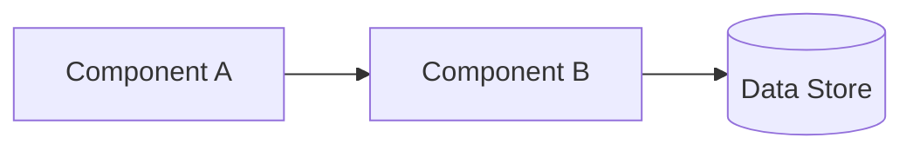
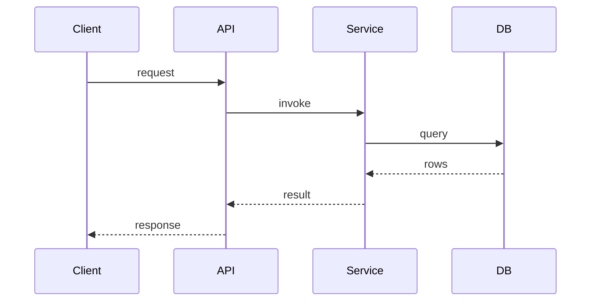
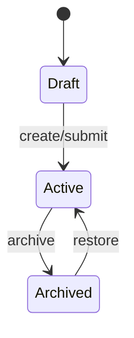
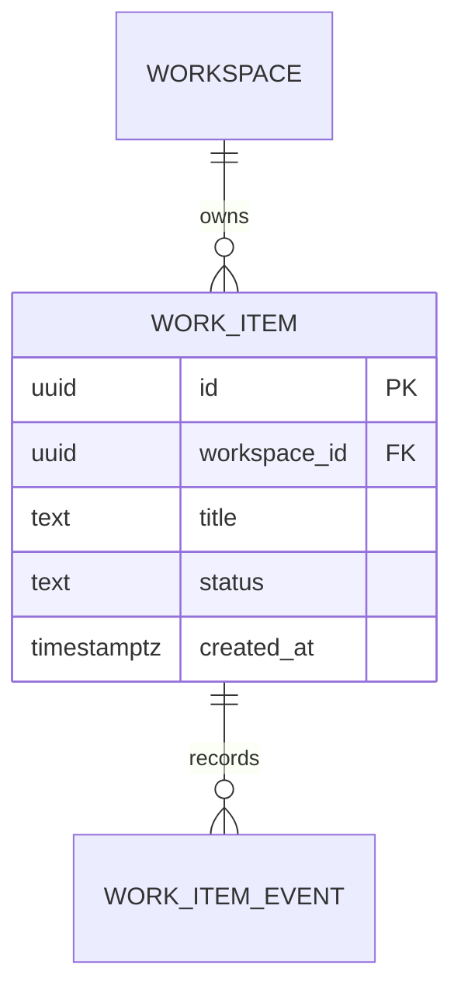
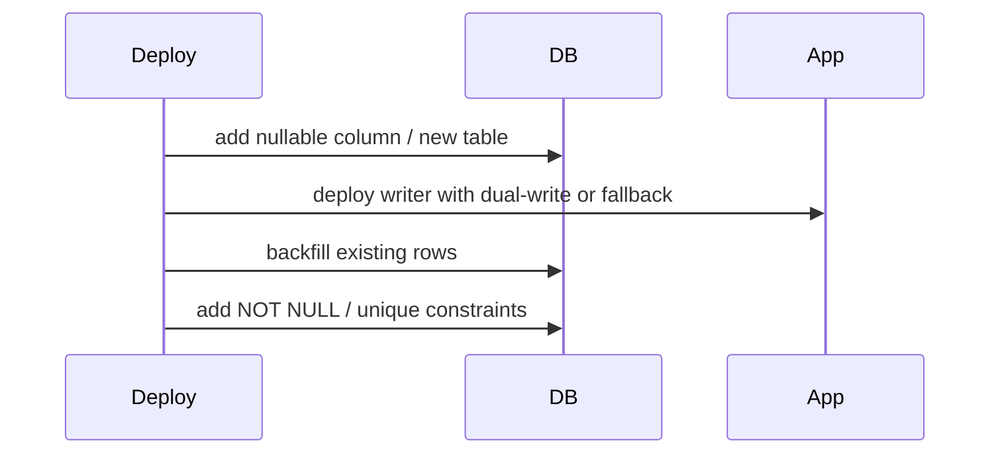

# Spec [Feature Name] — Detail Design

> **Reference**: [Detailed Goals](./spec-[feature-slug]-detailed-goal.md)
> **Next**: [Implementation Checklist](./spec-[feature-slug]-implementation-checklist.md)

> [!NOTE]
> This file has two parts:
> - **Part A — Skeleton**: Copy the structure below into `spec-<feature-slug>-detailed-design.md` and fill in the placeholders.
> - **Part B — Author Guidance**: How to actually produce each section (process, patterns, pitfalls). Read once before authoring; do not copy into the spec file.
> - Prefer Mermaid diagrams for architecture, flows, entity relationships, state changes, and migration/deployment sequences. Use concise text and tables only where exact details are required (contracts, columns, constraints, indexes, decisions).

---

# PART A — Skeleton (copy into `spec-<feature-slug>-detailed-design.md`)

## 1. Overview

[High-level summary: what this spec builds, the chosen approach in 3–5 sentences, and how it addresses the detailed goals.]

**Links to Requirements**:
- [Detailed Goal Section/ID] → [Brief description of how this design addresses it]
- [Detailed Goal Section/ID] → [...]

## 2. Design Scope

### In Scope
- [Design element / component / concern 1]
- [Design element / component / concern 2]

### Out of Scope
- [Item intentionally NOT designed this spec — reason]
- [Item 2 — reason]

## 3. Research Summary

> Document only findings that materially shaped design decisions. Cite sources.

### Finding 1: [Topic]
- **Context**: [Why this was researched]
- **Key insight**: [What was learned]
- **Source(s)**: [Link/reference]
- **Impact on design**: [Which decision(s) this informs]

### Finding 2: [Topic]
- **Context**: ...
- **Key insight**: ...
- **Source(s)**: ...
- **Impact on design**: ...

## 4. Architecture

### 4.1 System Overview
[High-level description of the system approach and how it fits into the existing codebase.]

### 4.2 Component Diagram
> Use Mermaid first. Keep prose short and use it only to explain non-obvious boundaries.



### 4.3 Data Flow
> Use Mermaid sequence diagrams for happy path and important failure/rollback flows. Add numbered text only when a step needs precise implementation detail.



### 4.4 State / Lifecycle Flow
> Required when the feature has meaningful statuses, workflow transitions, async jobs, retries, approvals, or deletion/archive flows.



### 4.5 Integration Points
| System | Direction | Protocol | Purpose |
|--------|-----------|----------|---------|
| [External system] | [in/out/both] | [REST/gRPC/queue/…] | [Why we integrate] |

### 4.6 Technology Stack
| Layer | Technology | Rationale |
|-------|------------|-----------|
| [e.g. API] | [Elysia] | [Why chosen — link to Decision Record if applicable] |
| [e.g. ORM] | [Drizzle] | [...] |

## 5. Components and Interfaces

### 5.1 [Component Name]
- **Purpose**: [What this component does]
- **Responsibilities**:
  - [Key function 1]
  - [Key function 2]
- **Public interface**:
  ```ts
  // signatures / contracts
  export class FooService {
    static doX(input: XInput): Promise<XOutput>
  }
  ```
- **Dependencies**: [Other components / external services this relies on]
- **Configuration**: [Env vars, DI bindings, feature flags]
- **Lifecycle**: [Stateless / singleton / per-request / worker]

### 5.2 [Component Name]
- **Purpose**: ...
- **Responsibilities**: ...
- **Public interface**: ...
- **Dependencies**: ...

## 6. Data Models

### 6.0 Data Relationship Diagram
> Use Mermaid ER diagrams for entity/table relationships. Keep relationship explanations short; put exact table details in Sec 6.4.



### 6.1 Persistence Overview
> Required when the spec touches persisted data. If no persistence is involved, explicitly write "No persistence changes".

- **Database / datastore**: [PostgreSQL / Redis / object storage / external system / none]
- **Existing schema area**: [schema/module where related tables already live]
- **New tables**: [list table names or "none"]
- **Modified tables**: [list table names or "none"]
- **Read/write ownership**: [which service/component owns writes and which components may read]
- **Transaction boundaries**: [operations that must commit/rollback together]
- **Migration strategy**: [DDL migration, backfill, reversible plan, rollout order]
- **Retention / archival / deletion**: [soft delete, hard delete, retention window, archive path]

### 6.2 [Entity Name]
- **Properties**:
  | Field | Type | Required | Notes |
  |-------|------|----------|-------|
  | id | uuid | yes | PK |
  | [field] | [type] | [y/n] | [constraints / defaults] |
- **Validation**: [Business-rule level validation]
- **Relationships**: [FKs, joins, cardinality]
- **Storage**: [Table name, indexes, partitioning if any]
- **Workspace isolation**: [How rows are scoped to a workspace — if applicable]

### 6.3 [Entity Name]
...

### 6.4 Database Tables
> For each table created or changed by this spec. Use concrete database column types, not only TypeScript/domain types.

#### `[table_name]` — [new / modified / existing-readonly]
- **Purpose**: [why this table exists in this feature]
- **Database**: [database/schema name]
- **Owner component**: [service/repository responsible for writes]
- **Columns**:
  | Column | DB Type | Nullable | Default | Constraints | Notes |
  |--------|---------|----------|---------|-------------|-------|
  | id | uuid | no | gen_random_uuid() | PK | [...] |
  | workspace_id | uuid | no | none | FK / indexed | required for workspace isolation |
  | created_at | timestamptz | no | now() | indexed if needed | [...] |
- **Primary key**: [...]
- **Foreign keys**: [...]
- **Unique constraints**: [...]
- **Indexes**: [name, columns, type, reason]
- **Check constraints**: [...]
- **Expected query patterns**: [filters, joins, sorting, pagination, aggregation]
- **Write patterns**: [insert/update/upsert/delete frequency and concurrency concerns]
- **Concurrency / locking**: [optimistic lock, row lock, advisory lock, none]
- **Partitioning / sharding**: [if needed, otherwise "not required"]

### 6.5 Migrations and Backfill
> Use Mermaid sequence or flowchart diagrams for rollout/backfill order when there is more than one migration/deployment step.



- **Migration files expected**: [file names or planned migration scope]
- **DDL changes**: [create/alter/drop table/index/constraint]
- **Backfill plan**: [required/not required; source data; batching; idempotency]
- **Rollback plan**: [how to revert or safely roll forward]
- **Deployment order**: [expand/contract steps if zero-downtime matters]
- **Data validation after migration**: [queries/checks/tests proving migration correctness]

## 7. API / Interface Contracts

> For every externally visible endpoint or cross-boundary contract.

### 7.1 `[METHOD] /path`
- **Purpose**: [What it does]
- **Auth**: [Required scopes/roles]
- **Request**:
  ```ts
  { /* Elysia.t or zod schema */ }
  ```
- **Response (success)**: `[status]` — `{ ... }`
- **Response (errors)**: See Sec 8.
- **Idempotency**: [yes/no — key strategy]

## 8. Error Handling

### 8.1 Error Categories
| Category | Examples | HTTP / Surface | User-visible? |
|----------|----------|----------------|---------------|
| Validation | bad input, schema fail | 400 | yes — field-level |
| Auth | missing / invalid token | 401/403 | yes — generic |
| Domain | business-rule violation | 409/422 | yes — actionable |
| Infra | DB down, upstream 5xx | 500/503 | yes — retry hint |

### 8.2 Response Strategy
- [How errors are serialized — shape of the error body]
- [Retry/backoff policy for transient errors]
- [Degraded-mode / graceful-fallback behavior]

### 8.3 Logging & Observability
- [What is logged vs. what is surfaced to user]
- [Tracing / Langfuse / metrics points]

## 9. Non-Functional Requirements

### 9.1 Performance
- **Targets**: [e.g. p95 API < 200ms, ingestion ≥ N docs/min]
- **Strategies**: [caching, indexes, batching, streaming]

### 9.2 Security
- **Auth & Authorization**: [Pattern used — link to Decision Record if material]
- **Input validation**: [Where and how]
- **Secrets & PII**: [Handling rules]

### 9.3 Scalability & Availability
- **Expected load**: [Requests/sec, concurrent users, data volume]
- **Scaling strategy**: [Horizontal/vertical, worker pools, queue depth]

### 9.4 Observability
- **Metrics**: [Key SLIs]
- **Tracing**: [Spans of interest]
- **Dashboards / alerts**: [If applicable]

## 10. Design Decisions (Decision Records)

> Every material technology/architecture/pattern choice MUST appear here using the pattern below.
> Minor, obvious choices do not require a record.

### Decision 1: [Brief title]
**Context**: [Situation requiring a decision]

**Options Considered**:
1. **[Option 1]**
   - Pros: [...]
   - Cons: [...]
2. **[Option 2]**
   - Pros: [...]
   - Cons: [...]

**Decision**: [Chosen option]
**Rationale**: [Why this option was selected — reference requirements/constraints]
**Implications**: [What this means for implementation, testing, ops]

### Decision 2: [...]
...

## 11. Testing Strategy

### 11.1 Testing Levels
| Level | Scope | Tools | Owner |
|-------|-------|-------|-------|
| Unit | [Pure logic, services in isolation] | [vitest/…] | Dev |
| Integration | [DB-backed, plugin wiring] | [real PostgreSQL test DB] | Dev |
| E2E | [User-visible flows] | [Playwright/…] | Dev/QA |

### 11.2 Persistence Verification
> When the spec touches persistence, explicitly describe how writes, reads, transactions, and constraints will be verified against a real PostgreSQL test database (per `spec-rule.md`).

- [Schema migration tests]
- [Constraint / FK / unique-index tests]
- [Transaction & rollback tests]
- [Workspace isolation tests]
- [Repository/service tests covering each expected query pattern from Sec 6.4]
- [Backfill/data migration verification from Sec 6.5, if applicable]

### 11.3 Test Coverage Goals
- [Must-cover scenarios]
- [Edge cases / failure modes]
- [What is explicitly NOT tested this spec — and why]

## 12. Traceability Matrix

| Detailed Goal / Requirement | Design Element(s) | Test(s) |
|-----------------------------|-------------------|---------|
| [Goal ID / title] | [Sec 5.1 FooService, Sec 6.2 Bar entity] | [Sec 11 unit: Foo.doX, integration: Bar CRUD] |
| [Goal ID] | [...] | [...] |

## 13. Deferred Design Items

> Design problems identified during this spec but intentionally pushed to a later spec.

| # | Item | Why deferred | Proposed spec |
|---|------|--------------|-----------------|
| D1 | [Description] | [Reason / dependency] | [Spec N+] |
| D2 | ... | ... | ... |

## 14. Quality Checklist

**Completeness**:
- [ ] All detailed goals are addressed in the design
- [ ] Major system components are defined (Sec 5)
- [ ] Data models cover all necessary entities (Sec 6)
- [ ] Persistence Overview is completed, or explicitly says no persistence changes (Sec 6.1)
- [ ] Every new/modified database table has concrete columns, types, constraints, indexes, ownership, query patterns, and write patterns (Sec 6.4)
- [ ] Migration/backfill/rollback strategy is defined for every schema or data change (Sec 6.5)
- [ ] API/interface contracts are specified (Sec 7)
- [ ] Error handling covers expected failure modes (Sec 8)
- [ ] Non-functional requirements addressed (Sec 9)
- [ ] Testing strategy addresses all system layers (Sec 11)
- [ ] Persistence verification covers migrations, constraints, transactions, query patterns, and workspace isolation when storage is touched (Sec 11.2)

**Clarity**:
- [ ] Component responsibilities are unambiguous
- [ ] Interfaces between components are specified with signatures
- [ ] Mermaid diagrams are present for non-trivial architecture, data flow, entity relationships, state/lifecycle, and migration/deployment flows
- [ ] Text explanations are concise and reserved for exact details that diagrams cannot carry clearly

**Decision Discipline**:
- [ ] Every material technology/architecture choice has a Decision Record (Sec 10)
- [ ] Each Decision Record contains Context / Options / Decision / Rationale / Implications

**Feasibility**:
- [ ] Design is achievable with the chosen technologies
- [ ] Performance targets are realistic
- [ ] Security requirements are addressed
- [ ] Implementation complexity is reasonable for the spec's capacity

**Traceability**:
- [ ] Traceability matrix (Sec 12) is complete — every goal maps to at least one design element and one test
- [ ] Every design element maps back to a goal (no orphans)
- [ ] Approval Gate is present and remains `Pending Confirmation` until the user/stakeholder explicitly approves moving to implementation planning

## 15. Approval Gate

> Do not create the implementation checklist or write code until this section is explicitly confirmed.

- **Status**: [Pending Confirmation | Approved | Needs Revision]
- **Confirmed by**: [name / role / user]
- **Confirmation date**: [YYYY-MM-DD]
- **Notes / required revisions before implementation**: [...]

---

# PART B — Author Guidance (do NOT copy into the spec file)

## Overview

The Design Phase transforms approved requirements into a comprehensive technical design that serves as a blueprint for implementation. This phase involves research, architectural decisions, and detailed planning that bridges the gap between what needs to be built (requirements) and how it will be built (implementation tasks).

## Purpose and Goals

The design phase serves to:
- Translate requirements into technical architecture and system design
- Conduct necessary research to inform design decisions
- Define system components, interfaces, and data models
- Establish error handling and testing strategies
- Create a foundation for breaking down work into implementation tasks
- Document design rationale and decision-making process

## Step-by-Step Process

### Visual-First Documentation Rule

Use Mermaid diagrams as the default representation for:
- Component relationships and ownership boundaries
- Request/data flows, including async and failure paths
- Entity/table relationships
- State transitions and lifecycle changes
- Migration, backfill, rollout, and rollback sequences

Use text or tables for details that need exactness:
- API contracts and type signatures
- Database columns, DB types, constraints, indexes, and query patterns
- Decision Records and rationale
- Security, performance, and testing requirements

### Step 1: Requirements Analysis and Research Planning

**Objective**: Understand requirements deeply and identify areas needing research

**Process**:
1. **Review Requirements Thoroughly**: Understand each requirement and its implications
2. **Identify Technical Unknowns**: List areas where research is needed
3. **Plan Research Activities**: Prioritize research based on design impact
4. **Set Research Boundaries**: Define scope to avoid analysis paralysis

**Research Areas to Consider**:
- Technology stack and framework choices
- Third-party integrations and APIs
- Performance and scalability requirements
- Security and compliance considerations
- Data storage and management approaches
- User interface and experience patterns

### Step 2: Conduct Research and Build Context

**Research Process**:
1. **Gather Information**: Research technologies, patterns, and best practices
2. **Evaluate Options**: Compare different approaches and their trade-offs
3. **Document Findings**: Summarize key insights that will inform design
4. **Make Preliminary Decisions**: Choose approaches based on research

**Research Documentation Guidelines**:
- Focus on findings that impact design decisions
- Include pros/cons of different approaches
- Cite sources and include relevant links
- Summarize key insights rather than exhaustive details
- Keep research contextual to the specific requirements
- → Record findings in Sec 3 of the skeleton.

### Step 3: Create System Architecture

**Architecture Components**:
1. **System Overview**: High-level description of how the system works
2. **Component Architecture**: Major system components and their relationships
3. **Data Flow**: How information moves through the system
4. **Integration Points**: External systems and APIs
5. **Technology Stack**: Chosen technologies and their rationale

→ Produce in Sec 4 of the skeleton. Use Mermaid for diagrams.

### Step 4: Define Components and Interfaces

**Component Design Elements**:
1. **Component Responsibilities**: What each component does
2. **Interface Definitions**: How components communicate (include type signatures)
3. **Dependency Relationships**: How components depend on each other
4. **Configuration and Setup**: How components are initialized

→ Produce in Sec 5 of the skeleton. Interface signatures should be concrete enough that the implementation checklist can reference them directly.

### Step 5: Design Data Models

**Data Model Elements**:
1. **Entity Definitions**: Core data structures and their properties
2. **Relationships**: How entities relate to each other
3. **Validation Rules**: Data integrity and business rules
4. **Storage Considerations**: How data will be persisted
5. **Workspace Isolation**: How multi-tenant scoping is enforced (project-specific requirement — see domain logic docs)
6. **Database Selection**: Which database/datastore is used and why it fits the feature
7. **Table Design**: Concrete table names, columns, DB types, constraints, indexes, ownership, and query/write patterns
8. **Migration Plan**: DDL changes, backfill needs, rollback/roll-forward approach, deployment order, and post-migration validation

→ Produce in Sec 6 of the skeleton.

### Step 6: Plan Error Handling and Edge Cases

**Error Handling Design**:
1. **Error Categories**: Types of errors the system might encounter
2. **Error Response Strategies**: How the system responds to different errors
3. **User Experience**: How errors are communicated to users
4. **Recovery Mechanisms**: How the system handles and recovers from errors

→ Produce in Sec 8 of the skeleton.

### Step 7: Define Testing Strategy

**Testing Strategy Elements**:
1. **Testing Levels**: Unit, integration, and end-to-end testing approaches
2. **Test Coverage**: What aspects of the system will be tested
3. **Testing Tools**: Frameworks and tools for different types of testing
4. **Quality Gates**: Criteria for determining when testing is sufficient
5. **Persistence Verification**: When persistence is touched, call out real-PostgreSQL test-DB verification explicitly (required by `spec-rule.md`)

→ Produce in Sec 11 of the skeleton.

## Decision Record Guidance

### When to write a Decision Record

Write one for any choice that:
- Affects more than one component or module
- Has a non-trivial reversibility cost
- Involves a new dependency, framework, or external service
- Has viable alternatives with meaningful trade-offs

Do NOT write Decision Records for trivial choices (naming, local refactors, obvious one-option decisions).

### Decision Record Template

```markdown
### Decision: [Brief title]

**Context**: [Situation requiring a decision]

**Options Considered**:
1. **[Option 1]**
   - Pros: [Benefits]
   - Cons: [Drawbacks]
2. **[Option 2]**
   - Pros: [Benefits]
   - Cons: [Drawbacks]

**Decision**: [Chosen option]
**Rationale**: [Why this option was selected]
**Implications**: [What this means for implementation]
```

### Key Decision Areas

**Technology Stack**: language/framework, DB/storage, libraries, deploy tooling.
**Architecture Patterns**: monolith vs services, sync vs async, caching, data flow.
**Security & Compliance**: authn/authz, encryption, validation, audit logging.
**Persistence Design**: database choice, schema/table structure, migration/backfill strategy, transaction boundaries, locking/concurrency model, indexing strategy.

## Examples of Design Decisions

### Example 1: API Design Decision

**Context**: Need to design REST API for user management

**Options Considered**:
1. **RESTful with standard HTTP methods** — Pros: standard, good tooling. Cons: may not fit all ops perfectly.
2. **GraphQL API** — Pros: flexible queries, single endpoint. Cons: added complexity.
3. **RPC-style API** — Pros: direct mapping to ops. Cons: less standard, harder to cache.

**Decision**: RESTful with standard HTTP methods
**Rationale**: Standard CRUD ops, team familiarity, good ecosystem.
**Implications**: Use Elysia controllers per resource; pagination via query params.

### Example 2: Data Storage Decision

**Context**: Store user profiles and preferences

**Options Considered**:
1. **PostgreSQL** — Pros: ACID, complex queries. Cons: schema rigidity.
2. **MongoDB** — Pros: schema flexibility. Cons: eventual consistency.
3. **Redis** — Pros: fast. Cons: limited query capability.

**Decision**: PostgreSQL with JSONB columns for flexible fields.
**Rationale**: Consistency and relational integrity required; JSONB covers flexibility.
**Implications**: Drizzle schema + zod for JSONB payload validation.

### Example 3: Authentication Strategy

**Context**: Secure user authentication

**Options Considered**:
1. **Session-based** — Pros: simple, server-controlled. Cons: state mgmt at scale.
2. **JWT** — Pros: stateless. Cons: revocation complexity.
3. **OAuth 2.0 external** — Pros: no password handling. Cons: external dep.

**Decision**: JWT with refresh-token rotation.
**Rationale**: API-first, scalability, aligns with current auth plugin.
**Implications**: Implement refresh endpoint; revocation via token-family tracking.

## Research Integration Guidelines

**Research Scope**:
- Focus on decisions that significantly impact the design
- Time-box to avoid analysis paralysis
- Prioritize by risk and uncertainty
- Document key findings, not exhaustive notes

**Research Documentation**:
- Summarize findings in the context of requirements
- Include links/sources for future reference
- Update design sections with research-informed decisions

**Research Areas by Feature Type**:
- **UI features**: UX patterns, accessibility, responsive design, interaction patterns
- **Data processing**: validation/transformation, perf optimization, error recovery, scalability
- **Integration**: API patterns, authn/authz, data sync, external-dependency error handling

## Common Design Pitfalls

### Pitfall 1: Over-Engineering
**Problem**: Designing for requirements that don't exist.
**Solution**: Focus on current requirements; design for extensibility but don't implement unused features.

### Pitfall 2: Under-Specified Interfaces
**Problem**: Vague component boundaries and interactions.
**Solution**: Clearly define what each component does and how components communicate (include signatures in Sec 5).

### Pitfall 3: Vague Persistence Design
**Problem**: Design says "save to database" without naming the database, table, columns, constraints, indexes, query patterns, migration, or owner.
**Solution**: Complete Sec 6.1, Sec 6.4, and Sec 6.5 with concrete database/table details. Each persisted entity must map to a table or explicitly state where it is stored.

### Pitfall 4: Ignoring Non-Functional Requirements
**Problem**: Focusing only on functional behavior.
**Solution**: Address performance, security, scalability, and maintainability explicitly in Sec 9.

### Pitfall 5: Technology-First Design
**Problem**: Choosing technologies before understanding requirements.
**Solution**: Let requirements drive technology choices, not the reverse.

### Pitfall 6: Insufficient Error Handling Design
**Problem**: Only designing for happy path scenarios.
**Solution**: Explicitly design error handling and edge-case behavior in Sec 8.

### Pitfall 7: Missing Traceability
**Problem**: Design elements that don't map back to any goal, or goals that no design element addresses.
**Solution**: Complete Sec 12 (Traceability Matrix) and enforce it via Sec 14.

## Troubleshooting Design Issues

### Issue: Design Becomes Too Complex
**Symptoms**: Design document is overwhelming, too many components.
**Solution**: Simplify by focusing on core requirements; consider phased implementation and move the rest to Sec 13 (Deferred).

### Issue: Requirements Don't Map to Design
**Symptoms**: Difficulty tracing requirements to design elements.
**Solution**: Walk the detailed-goal file requirement-by-requirement and ensure each appears in Sec 12.

### Issue: Technology Choices Are Unclear
**Symptoms**: Multiple viable options without clear selection criteria.
**Solution**: Define decision criteria based on requirements and constraints, then record the choice in Sec 10.

### Issue: Design Lacks Detail for Implementation
**Symptoms**: Developers can't start coding from the design.
**Solution**: Add concrete type signatures in Sec 5 and concrete schema/field tables in Sec 6 so the implementation checklist can map 1:1 to files.
