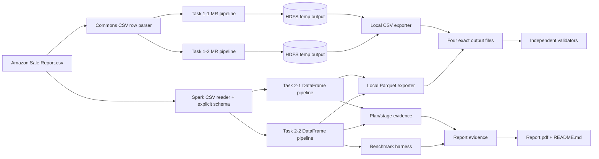
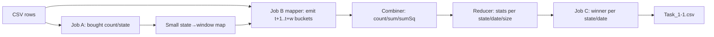
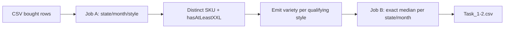
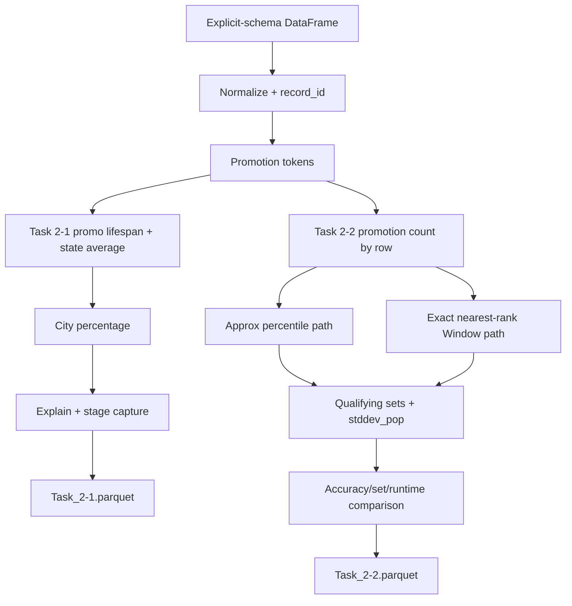
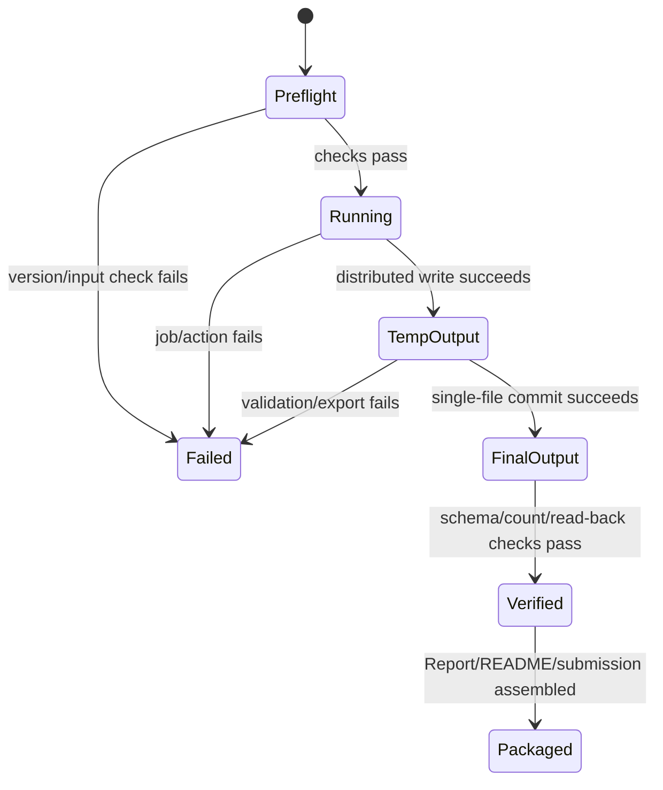
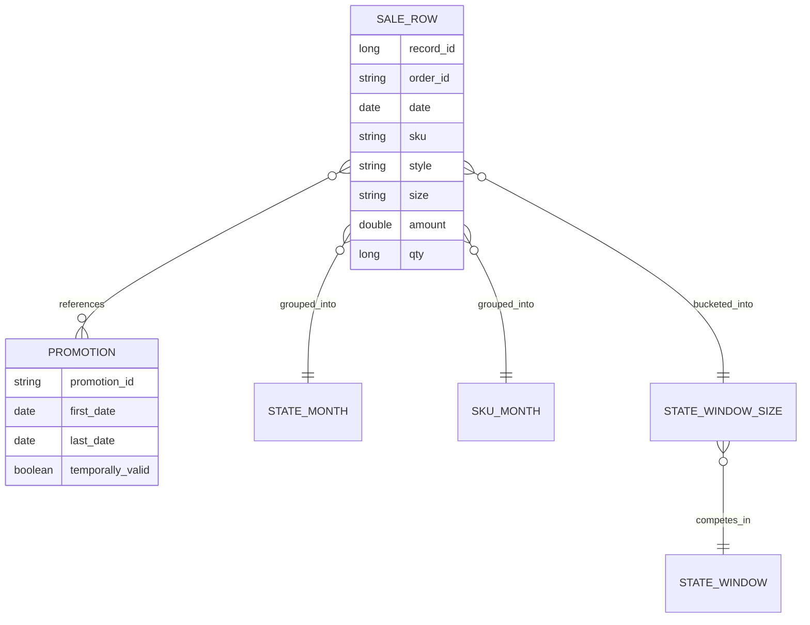

# Big Data Lab 3 — Detailed Design

> **Reference**: [Detailed Goals](./spec-bigdata-lab3-detailed-goal.md)
>
> **Next**: Implementation Checklist — chỉ tạo sau khi tài liệu này được xác nhận
>
> **Rules thực thi**: [rules.md](./rules.md)

> **Source update 2026-08-31**: Các semantics và số liệu kiểm chứng trong thiết kế này phải đối chiếu với [`Lab3_Slide_ref.pdf`](../../../../Lab3_Slide_ref.pdf). Những quyết định nghiệp vụ đã chốt được ghi tại Sec 10; không tự thay đổi trong code.

## 1. Overview
Revision note 2026-08-12: the final submission contract now flattens task source roots to `src/Task_*`, omits a top-level `scripts/` directory, and expects `docs/README.md` to carry the WSL-friendly terminal runbook with `<user_name>` placeholders.
Note: the layout change also includes fixing any scripts or source-level path references that would otherwise break after flattening the tree.

Lời giải là một project Scala/SBT thống nhất gồm bốn command-line jobs: hai pipeline Hadoop MapReduce chạy trên pseudo-distributed Hadoop và hai Spark jobs dùng duy nhất DataFrame/Dataset transformations. Một lớp parse/chuẩn hóa dùng chung giữ semantics nhất quán; mỗi task có pipeline riêng, kiểm thử fixture tính tay và exporter tạo đúng một tệp vật lý trên local filesystem. Report source, evidence logs và README tiếng Việt được đặt cùng submission tree để có thể tái lập từ terminal.

**Liên kết requirements**:

- R-GEN-01 đến R-GEN-03 → Sec 4.6, 5.1, 5.8, 9, 10, 11.
- R-MR-11-* → Sec 4.3, 5.2, 6.2, 7.2, 10.3, 11.
- R-MR-12-* → Sec 4.3, 5.3, 6.3, 7.3, 10.4, 11.
- R-SP-21-* → Sec 4.3, 5.4, 5.6, 6.4, 7.4, 10.5, 11.
- R-SP-22-* → Sec 4.3, 5.5, 5.7, 6.5, 7.5, 10.6–10.7, 11.
- R-SUB-* → Sec 4.4, 5.8, 7.1, 7.6, 10.8.

## 2. Design Scope

### In Scope

- SBT layout và version contract cho Scala/Hadoop/Spark.
- CSV parser/schema/normalization và data-quality counters.
- Ba-stage MapReduce pipeline cho Task 1-1 và pipeline gồm Job A1 (qualifying style toàn cục), Job A2 (variety) và Job B (median) cho Task 1-2.
- Hai Spark DataFrame/Dataset pipelines, plan/stage capture và benchmark harness.
- Exact output schemas, single-file export, validation và submission layout.
- Unit, local integration và pseudo-distributed end-to-end tests.
- Source documents cho README/Report và vị trí evidence.

### Out of Scope

- Top-level `scripts/` directory as a required submission artifact; shell workflow is documented in `docs/README.md` instead.

- Database, REST API, UI, streaming, cloud/Colab và production deployment.
- Tự động upload Google Drive hoặc submit Moodle.
- `shapes.parquet(legacy)`: đã kiểm tra là dataset 1.000 hình gồm `shape_id`/`vertices`, không liên quan PDF hoặc Amazon Sales; không đưa vào pipeline.
- Tự quyết định RepresentativeID, Drive URL hoặc deadline; giữ placeholder cho đến khi người dùng cung cấp.

## 3. Research Summary

### 3.1 Hadoop MapReduce 3.3.6

- **Context**: Task 1-1 bắt buộc map-to-buckets, combine/reduce và cần phân tích shuffle.
- **Kết luận**: Hadoop cho phép cấu hình Mapper, Combiner, Partitioner, Reducer; combiner thực hiện local aggregation để giảm dữ liệu truyền sang reducer. Output mặc định là các part files trong filesystem đích.
- **Nguồn**: [Apache Hadoop 3.3.6 MapReduce Tutorial](https://hadoop.apache.org/docs/r3.3.6/hadoop-mapreduce-client/hadoop-mapreduce-client-core/MapReduceTutorial.html).
- **Tác động**: dùng accumulator kết hợp có tính kết hợp/giao hoán cho Task 1-1; single-file local export là bước commit riêng sau job thành công.

### 3.2 Spark/Scala compatibility

- **Context**: môi trường đã biết có Java 8 và Scala 2.11.12 nhưng chưa có phiên bản Spark.
- **Kết luận**: Spark 3.x đã bỏ Scala 2.11; Spark 2.4.x còn hỗ trợ Scala 2.11. Spark 2.4.8 có binary archive chính thức và là baseline phù hợp nhất với ràng buộc hiện tại.
- **Nguồn**: [Spark 3.5.8 build documentation](https://spark.apache.org/docs/3.5.8/building-spark.html), [Spark 2.4.8 archive](https://archive.apache.org/dist/spark/spark-2.4.8/), [Spark 2.4.8 API docs](https://archive.apache.org/dist/spark/docs/2.4.8/api.html).
- **Tác động**: baseline compile là Scala 2.11.12 + Spark SQL 2.4.8. Trước implementation phải chạy `spark-submit --version`; nếu Lab 1 cung cấp Spark khác, đây là design drift cần cập nhật trước code.

### 3.3 Approximate percentile

- **Context**: Task 2-2 bắt buộc built-in `approx_percentile`/`percentile_approx` và một exact implementation.
- **Kết luận**: built-in approximate percentile chọn một giá trị theo phân bố với accuracy điều khiển sai số tương đối; Spark 2.4 có function ở SQL engine nhưng Scala `functions.percentile_approx(Column,...)` wrapper chỉ xuất hiện ở Spark mới.
- **Nguồn**: [Spark built-in aggregate functions](https://spark.apache.org/docs/latest/sql-ref-functions-builtin.html), [Spark SQL migration guide](https://spark.apache.org/docs/latest/sql-migration-guide.html).
- **Tác động**: baseline Spark 2.4.8 gọi built-in bằng `functions.expr("percentile_approx(...)")` trong `groupBy.agg`; không dùng `spark.sql(...)` hay một SQL query. Exact path dùng Window/DataFrame operations và nearest-rank để so sánh cùng semantics.

### 3.4 Profiling input thực tế

- **Context**: cần khóa grain, null policy và partition analysis.
- **Kết luận**: 128.975 rows, 120.378 Order IDs, 6.846 IDs lặp, tối đa 12 rows/order; ngày 2022-03-31 đến 2022-06-29; 7.795 Amount null; không có SKU-month >1.000 rows, group lớn nhất 426. CSV có quoted promotion lists nhưng không có embedded newline.
- **Nguồn**: read-only profiling của `Amazon Sale Report.csv` ngày 2026-08-10.
- **Tác động**: atomic grain là một CSV row (`index` làm `record_id`); Report ghi rõ không có group >1.000; parser phải hiểu CSV quoting và null.

## 4. Architecture

### 4.1 System Overview

Project dùng một SBT build, shared domain/parser/testing utilities và bốn main classes. MapReduce đọc CSV từ HDFS, ghi intermediate HDFS và export final CSV về local filesystem. Spark đọc CSV bằng explicit schema trên local filesystem, thực hiện transformations bằng Structured APIs, ghi temporary Parquet directory rồi atomically chọn/đổi tên part file thành filename bắt buộc.

### 4.2 Component Diagram



### 4.3 Data Flows

#### Task 1-1



#### Task 1-2



#### Spark tasks



### 4.4 Run/Artifact Lifecycle



Không ghi đè final output trước khi temporary output hoàn tất và được validate. Re-run dùng run-specific temp path; final file chỉ được thay thế ở bước commit có chủ đích.

### 4.5 Integration Points

| System | Direction | Protocol | Purpose |
|---|---|---|---|
| Local filesystem | in/out | `file:///`, Java NIO/Hadoop LocalFileSystem | Đọc source cho Spark, ghi final/report/evidence |
| HDFS 3.3.6 | in/out | `hdfs://`, Hadoop FileSystem API | Input/intermediate cho MapReduce |
| YARN/MapReduce | out | Hadoop Job API | Chạy hai MapReduce pipelines |
| Spark local runtime | out | `spark-submit --master local[*]` | Chạy Structured APIs và thu plan/stage |
| Google Drive | manual out | Browser upload | Chứa bốn output; không tự động hóa |
| Moodle | manual out | Browser upload | Nộp `<RepresentativeID>.zip`; không tự động hóa |

### 4.6 Technology Stack

| Layer | Technology | Version/baseline | Rationale |
|---|---|---|---|
| Language | Scala | 2.11.12 | Môi trường người dùng và full language score |
| JVM | Java | 8 | Môi trường Lab 1 |
| Build | SBT | Java-8-compatible, pin trong `project/build.properties` | Multi-main build và dependency pinning |
| MapReduce | Hadoop client API | 3.3.6, `provided` | Khớp pseudo-distributed cluster |
| Spark | `spark-sql_2.11` | 2.4.8, `provided` | Baseline cuối tương thích Scala 2.11 |
| CSV/MR | Apache Commons CSV | Java-8-compatible pinned version | Hadoop `TextInputFormat` không parse quoted comma đúng |
| Tests | ScalaTest | 3.0.8 | Tương thích Scala 2.11 |
| Output | CSV + Parquet | UTF-8 CSV, Spark Parquet | Exact grading contract |

## 5. Components and Interfaces

### 5.1 Shared domain, parsing và normalization

- **Purpose**: một semantics chung cho ngày, text, promotion, bought predicate, size và amount.
- **Interfaces dự kiến**:

```scala
final case class SaleRow(
  recordId: Long,
  orderId: String,
  date: java.time.LocalDate,
  status: String,
  fulfilment: String,
  serviceLevel: String,
  style: Option[String],
  sku: Option[String],
  size: Option[String],
  courierStatus: Option[String],
  qty: Long,
  amount: Option[Double],
  city: Option[String],
  state: Option[String],
  promotionIds: Vector[String]
)

object Normalization {
  def normalizeDimension(value: String): Option[String]
  def isBought(status: String, qty: Long): Boolean
  def isAtLeastXXL(size: String): Boolean
  def parsePromotions(raw: String): Vector[String]
}

object SaleRowParser {
  def parseCsvRecord(line: String): Either[DataError, SaleRow]
}
```

- **Quy tắc**:
  - `record_id` lấy từ cột `index`; fail record nếu thiếu/không phải Long.
  - ngày parse strict `MM-dd-yy`; month output `yyyy-MM`.
  - dimension trim, collapse whitespace, uppercase bằng `Locale.ROOT`.
  - promotions split theo comma sau CSV parsing, trim, bỏ empty, `distinct` trong một row; promotion Amazon không bị loại.
  - `isBought`: normalized `Status` chứa `SHIPPED` và `Qty > 0`.
  - `isAtLeastXXL`: `XXL`, `2XL`, `XXXL`, `3XL`, `4XL`, `5XL`, `6XL` và pattern `NXL` với `N >= 2`; `Free`/không nhận diện là false.
- **Dependencies**: Commons CSV cho MR; Spark built-in CSV/split/trim cho Structured APIs.
- **Lifecycle**: stateless.

### 5.2 Task 1-1 MapReduce pipeline

```scala
final case class Moment(count: Long, amountCount: Long, sum: Double, sumSquares: Double) {
  def combine(other: Moment): Moment
  def populationVariance: Option[Double]
}

object Task11Driver {
  def run(inputHdfs: Path, workHdfs: Path, outputLocal: java.nio.file.Path): Int
}
```

- **Job A**: bought rows → `(state, 1)`; sum combiner/reducer → total bought count/state.
- **Window map**: `count > 10000 ? 5 : 10`; state map được driver đọc và đưa qua distributed cache/config nhỏ.
- **Job B mapper**: bought row ngày `t` phát chính xác `w` khóa `(state, t+i, size)`, `i=1..w`. Vì vậy output date range có thể tới `maxDate + w`; đây là cách hiểu trực tiếp của map-to-buckets và giải thích “unseen timestamps”.
  - **Job B combiner/reducer**: combine `Moment`. Frequency là count của bought rows; `Amount=NULL` vẫn tính frequency nhưng không vào moments. `amountCount=0` → variance chưa xác định và xếp sau mọi variance hữu hạn khi tie; `amountCount=1` → variance 0. Sai số âm rất nhỏ do floating point được clamp về 0.
- **Job C**: group `(state, windowDate)`; chọn max frequency, min variance (undefined = +∞), min lexicographical size.
- **Parallelism**: Job A/B của Task 1-1 có reducer count configurable; Job C dùng 1 reducer cho dataset lab để tạo một part file, nhưng exporter vẫn chịu trách nhiệm header và exact filename. Task 1-2 dùng A1→A2→B theo Decision 4.

### 5.3 Task 1-2 MapReduce pipeline

```scala
object Task12Driver {
  def run(inputHdfs: Path, workHdfs: Path, outputLocal: java.nio.file.Path): Int
}

object Median {
  def exact(values: IndexedSeq[Long]): Double
}
```

- Chỉ dùng bought rows vì truy vấn định nghĩa variety của goods “purchased” và đề vừa định nghĩa bought semantics (`Status` chứa `shipped` và `Qty > 0`).
- **Job A1**: key `style`, tính `max(sizeRank)` trên toàn dataset; chỉ style có rank `>= XXL` mới được đưa vào tập qualifying toàn cục. Đây là quyết định khớp file đáp án của giảng viên.
- **Job A2**: key `(state, month, style, sku)`, loại SKU trùng, sau đó tính variety theo `(state,month,style)` và join/filter với tập qualifying style từ Job A1 (phát tập style nhỏ qua Distributed Cache/config). Không dùng scope cục bộ theo state-tháng cho kết quả chính.
- **Job B**: reducer thu variety cho `(state,month)`, sort tăng dần và tính exact median; odd lấy giữa, even lấy mean hai giữa bằng Double.
- Không emit group không có qualifying style. Một reducer ở Job B bảo đảm single part cho lab; thiết kế vẫn đúng với nhiều reducer nếu exporter merge, nhưng ordering không phải semantics.

### 5.4 Task 2-1 Spark pipeline

```scala
object Task21Job {
  def build(spark: SparkSession, input: String): DataFrame
  def run(spark: SparkSession, input: String, output: String, evidenceDir: String): Unit
}
```

1. Đọc explicit schema; tạo normalized columns và `record_id`.
2. Explode distinct promotion tokens, group promotion ID để lấy `min(date)`, `max(date)`, `datediff >= 2`; full-data baseline là 284 mã, 185 mã hợp lệ.
3. Join valid promotions về record, count distinct identifiers per row; missing → 0.
4. State average: rows có exact normalized `FULFILMENT=MERCHANT`, `COURIER STATUS=SHIPPED`, Amount non-null; `avg(amount)` theo state.
5. Denominator: mọi row có `STATUS` chứa `CANCELLED` và `SERVICE LEVEL=STANDARD` có city/state hợp lệ, kể cả Amount null; slide baseline là 6.909 rows, còn CSV hiện tại tái lập được 6.906 rows.
6. Numerator: denominator rows có valid promo count ≥3, Amount non-null và Amount < state average.
7. Group bằng `(state, city)` để tránh trộn hai city trùng tên khác state; percentage = `100.0 * numerator / denominator`. CSV hiện tại cho 1.442 groups và 0% ở mọi group, so với slide baseline 1.435 city.
8. Không emit city có denominator 0 vì denominator được tạo từ base. City không có state average có numerator 0.

### 5.5 Task 2-2 Spark pipeline

```scala
object Task22Job {
  def buildApprox(base: DataFrame, accuracy: Int): DataFrame
  def buildExact(base: DataFrame): DataFrame
  def compare(approx: DataFrame, exact: DataFrame): ComparisonArtifacts
  def run(spark: SparkSession, input: String, output: String, evidenceDir: String): Unit
}
```

- Grain là một valid CSV row; group key `(sku, month)`; promotion count là số distinct token trong row.
- Empty `promotion-ids` maps to count 0; Amazon promotions remain included. Full-data baseline is 16.486 SKU-month groups and counts range from 0 to 26.
- Percentile population gồm mọi row có valid date và SKU, kể cả Amount null.
- **Approx**: `groupBy("sku","month").agg(expr("percentile_approx(promotion_count, array(0.8, 0.9), 10000)"))`, sau đó explode thành P80/P90. Đây là Column expression trong DataFrame API, không phải `spark.sql` query.
- **Exact**: Window partition `(sku,month)`, order `promotion_count ASC, record_id ASC`; `N=count(*)`, rank `ceil(p*N)` theo nearest-rank cho p=0.8/0.9; threshold là promotion count tại rank.
- Qualifying set dùng `promotion_count >= threshold` cho từng method/level.
- `qualifying_order_count` đếm mọi qualifying rows; `amount_value_count` đếm Amount non-null. Nếu qualifying count <2 hoặc không có Amount hợp lệ thì `amount_stddev_pop=0`; ngược lại dùng `stddev_pop` trên valid Amount (Spark bỏ null).
- Output chứa cả `approx` và `exact`; comparison evidence chứa threshold difference và symmetric-difference record IDs, không đưa danh sách lớn vào final Parquet.
- Profiling group size chạy trước; dữ liệu hiện tại có max 426 nên evidence/report ghi “không có group >1.000”, không manual repartition riêng group.
- Evidence SHALL record the largest group as 426 rows/approximately 222 KB; this is far below 128 MB. The report may recommend reducing the default 200 shuffle partitions to 8–16 or enabling AQE coalesce, but SHALL not claim manual group repartition is beneficial without a benchmark.

### 5.6 Plan và stage evidence

```scala
final class StageCollector(targetJobGroup: String) extends SparkListener {
  def stageIds: Set[Int]
}

object PlanEvidence {
  def writeExtendedPlan(df: DataFrame, path: java.nio.file.Path): Unit
  def countExchangeNodes(executedPlan: String): Int
  def joinStrategies(executedPlan: String): Seq[String]
}
```

- Gắn Spark job group riêng cho Task 2-1 action.
- Lưu parsed/analyzed/optimized/physical plan tương đương `explain(true)` vào evidence text; đồng thời gọi `explain(true)` để console log có bằng chứng nguyên bản.
- Sau action, lấy executed physical plan để đếm chính xác node tên `Exchange` và nhận diện join operator thực tế; không dự đoán trước kết quả optimizer.
- `StageCollector` đếm unique stage IDs thuộc action/job group; Report nêu Spark config và cache state tại thời điểm đo.

### 5.7 Benchmark harness

```scala
final case class BenchmarkSample(method: String, run: Int, elapsedMs: Long)
final case class BenchmarkSummary(method: String, runs: Int, meanMs: Double, sampleStddevMs: Double)

object BenchmarkHarness {
  def measure(label: String, warmups: Int = 1, runs: Int = 5)(action: => Unit): BenchmarkSummary
}
```

- Cache và materialize cùng normalized base trước cả hai method.
- Một warm-up không tính vào thống kê, sau đó 5 measured runs/method, thứ tự xen kẽ approx/exact để giảm bias nhiệt/GC.
- Mỗi run ép full action (`count`/write temp với cùng sink strategy), xóa/unpersist method-specific result giữa runs.
- Báo arithmetic mean và sample standard deviation (`n-1`), giữ raw 10 samples trong CSV evidence.

### 5.8 Export, validation và documentation

```scala
object SingleFileExporter {
  def exportCsv(hdfsOutput: Path, header: String, localTarget: java.nio.file.Path): Unit
  def exportParquet(df: DataFrame, localTarget: java.nio.file.Path): Unit
}

object OutputValidator {
  def validateCsv(path: java.nio.file.Path, expectedHeader: Seq[String]): Unit
  def validateParquet(spark: SparkSession, path: String, expectedSchema: StructType): Unit
}
```

- CSV: đọc sorted `part-*` thành temporary local file, ghi header một lần, append data UTF-8, fsync/close, rồi move thành target; `_SUCCESS` không được merge.
- Parquet: `coalesce(1)` chỉ ở final nhỏ đã aggregate, ghi temporary local directory, xác nhận đúng một `part-*.parquet`, move thành target exact filename, xóa temp sau thành công.
- Không dùng `coalesce(1)` trước aggregate/window vì sẽ phá parallelism.
- Validation đọc lại exact final path, schema, non-negative counts, percentage [0,100], finite variance/stddev và uniqueness của logical keys.
- `docs/README.md` là tiếng Việt, terminal-first. `docs/Report.md` là source; chuyển thành `Report.pdf` bằng công cụ có sẵn được khóa ở checklist. Evidence đặt `docs/evidence/` nhưng có thể loại khỏi ZIP nếu cấu trúc giảng viên yêu cầu chỉ artefact tối thiểu.

## 6. Data Models

### 6.0 Logical Relationships



### 6.1 Persistence Overview

- **Database**: none; không có schema/table/migration.
- **Persistent stores**: immutable source CSV, temporary HDFS/local job outputs, four final local files và documentation/evidence.
- **Write ownership**: mỗi task chỉ sở hữu temp namespace và final filename của mình.
- **Transaction boundary**: job success + read-back validation + local move là một logical commit; failure giữ final cũ (nếu có) và trả non-zero.
- **Retention**: temp run directories xóa sau success; giữ khi failure để debug; final artefacts giữ đến submission.
- **Workspace isolation**: not applicable.

### 6.2 `Task_1-1.csv`

| Column | Type/format | Nullable | Meaning |
|---|---|---|---|
| `state` | UTF-8 string normalized | no | State |
| `window_date` | `yyyy-MM-dd` | no | Ngày d, cửa sổ không gồm d |
| `window_days` | integer 5/10 | no | Độ dài theo total bought state |
| `winning_size` | string | no | Size sau tie-break |
| `frequency` | long | no | Bought rows của size thắng |
| `population_variance` | double/empty | yes | Null khi không có Amount hợp lệ |

Primary logical key: `(state, window_date)`.

### 6.3 `Task_1-2.csv`

| Column | Type/format | Nullable | Meaning |
|---|---|---|---|
| `state` | string normalized | no | State |
| `month` | `yyyy-MM` | no | Calendar month |
| `median_variety` | double | no | Exact median distinct SKU/style |
| `qualifying_style_count` | long | no | Số style có size ≥XXL |

Primary logical key: `(state, month)`.

### 6.4 `Task_2-1.parquet`

| Column | Spark type | Nullable | Meaning |
|---|---|---|---|
| `state` | StringType | no | Normalized state |
| `city` | StringType | no | Normalized city |
| `cancelled_standard_orders` | LongType | no | Denominator |
| `qualifying_orders` | LongType | no | Numerator |
| `percentage` | DoubleType | no | `100*numerator/denominator` |

Primary logical key: `(state, city)`.

### 6.5 `Task_2-2.parquet`

| Column | Spark type | Nullable | Meaning |
|---|---|---|---|
| `sku` | StringType | no | SKU |
| `month` | StringType | no | `yyyy-MM` |
| `method` | StringType | no | `approx` hoặc `exact` |
| `percentile_level` | StringType | no | `P80` hoặc `P90` |
| `threshold` | DoubleType | no | Promotion-count threshold |
| `qualifying_order_count` | LongType | no | Rows có count ≥ threshold |
| `amount_value_count` | LongType | no | Qualifying rows có Amount |
| `amount_stddev_pop` | DoubleType | no | Population SD; zero theo rule |

Primary logical key: `(sku, month, method, percentile_level)`.

### 6.6 Migrations and Backfill

Không có database migration/backfill. Input không bị sửa. Rebuild toàn bộ output từ source là cơ chế khôi phục; không có incremental state.

## 7. CLI và File Contracts

### 7.1 Submission layout

```text
<RepresentativeID>/
  build.sbt
  project/build.properties
  src/
    common/source/...
    Task_1-1/...
    Task_1-2/...
    Task_2-1/...
    Task_2-2/...
  test/scala/...
  docs/
    README.md
    Report.md
    Report.pdf
    drive_link.txt
    evidence/...
```

Task_* roots are direct source roots. A top-level `scripts/` directory is not part of the final submission; shell workflow lives in `docs/README.md`.

`source/` của từng task chứa main và task-specific classes đúng cấu trúc đề; shared code nằm `src/common/source` để tránh copy logic. Build files là artefact hỗ trợ ở root.

### 7.2 Task 1-1 CLI

```text
Task11Main --input hdfs:///lab3/asr.csv --work hdfs:///lab3/work/task11 --output-local /.../Task_1-1.csv [--reducers N]
```

### 7.3 Task 1-2 CLI

```text
Task12Main --input hdfs:///lab3/asr.csv --work hdfs:///lab3/work/task12 --output-local /.../Task_1-2.csv [--reducers N]
```

### 7.4 Task 2-1 CLI

```text
spark-submit --class lab3.task21.Task21Main lab3.jar --input file:///.../Amazon%20Sale%20Report.csv --output-local /.../Task_2-1.parquet --evidence-dir /.../docs/evidence/task21
```

### 7.5 Task 2-2 CLI

```text
spark-submit --class lab3.task22.Task22Main lab3.jar --input file:///.../Amazon%20Sale%20Report.csv --output-local /.../Task_2-2.parquet --evidence-dir /.../docs/evidence/task22 --accuracy 10000 --runs 5
```

Validation: required option/path absent, `runs < 5`, `accuracy <= 0`, existing work path hoặc unsupported URI → message rõ trên stderr và exit non-zero. Final output tồn tại cần `--overwrite` rõ ràng; không tự ghi đè.

### 7.6 External manual contracts

- `drive_link.txt`: đúng một non-empty HTTPS URL do người dùng cung cấp.
- `<RepresentativeID>`: non-empty student ID do người dùng cung cấp trước packaging.
- ZIP: root entry duy nhất là `<RepresentativeID>/`; tên file `<RepresentativeID>.zip`.

## 8. Error Handling

### 8.1 Error Categories

| Category | Examples | Surface | Strategy |
|---|---|---|---|
| Preflight | sai Java/Scala/Spark, HDFS/YARN chưa chạy | stderr + exit 2 | Dừng trước job, README nêu lệnh sửa |
| CLI | thiếu arg, path sai, output tồn tại | stderr + usage + exit 2 | Không ghi dữ liệu |
| CSV structural | sai số cột/quoted CSV | counter + sampled stderr | Fail job nếu structural corruption; không split naïve |
| Record validation | date/id/qty sai, dimension bắt buộc null | Hadoop counter/Spark metrics | Loại khỏi task liên quan, ghi count; fail nếu vượt 0 cho date/id structural fields |
| Numeric null | Amount null | task-specific policy | Không coerce 0; counter/report |
| Distributed execution | mapper/reducer/executor failure | framework logs + non-zero | Framework retry; không commit final |
| Output validation | schema/key/finite check fail | stderr + exit 1 | Giữ temp, không replace final |
| Documentation external | thiếu ID/Drive URL/PDF tool | checklist blocker | Code/output vẫn test; không tuyên bố package hoàn tất |

### 8.2 Data-quality policy

| Field/problem | Policy |
|---|---|
| Invalid `record_id`/Date | Fail validation; source hiện tại phải không có lỗi |
| Missing state/city/style/SKU/size | Exclude khỏi computation cần field đó; count/report |
| Invalid Qty | Không coi bought; count/report |
| Amount null Task 1-1 | Count frequency/bought total; bỏ khỏi variance moments |
| Amount null Task 2-1 | Có thể vào denominator; không vào state avg/numerator |
| Amount null Task 2-2 | Vẫn vào percentile/qualifying order count; không vào stddev values |
| Empty promotion | Count 0 |
| Unknown size | Không đạt ≥XXL; vẫn có thể là size ở Task 1-1 nếu non-empty |

### 8.3 Logging và observability

- Hadoop counters: rows read, bought, per-reason rejected, buckets emitted, map output records/bytes, combine input/output, reduce input/output, spilled records.
- Spark metrics/evidence: row counts sau filter, valid promotion count, null counts, physical plan, joins, Exchange count, stages, group max size, benchmark raw/summary.
- Không log toàn bộ promotion IDs hoặc row data; chỉ tối đa 10 sampled invalid records, tránh log dữ liệu địa chỉ không cần thiết.

## 9. Non-Functional Requirements

### 9.1 Performance

- Task 1-1 mapper phát tối đa 10 records/bought row: `O(n*w)`, với `w≤10` là `O(n)` theo dataset; tránh naive quét lại toàn dataset cho mỗi ngày/state (`O(D*n)`). Combiner giảm shuffle từ tối đa `n*w` raw values xuống số keys cục bộ.
- Task 1-2 distinct SKU nằm ở reducer per style; exact median sort `k` varieties per state-month, `O(k log k)`.
- Spark chỉ cache normalized base cho benchmark; không `collect()` toàn dataset. Chỉ collect small summaries/evidence.
- `coalesce(1)` chỉ áp dụng result aggregate nhỏ khi export.

### 9.2 Security và data handling

- Không có auth/secrets. Input chứa địa chỉ; output chỉ state/city/aggregate, không xuất Order ID/postal code.
- Validate paths và không cho temp cleanup vượt ra ngoài task work directory.
- Không embed credential/Drive token trong source hoặc README.

### 9.3 Scalability và availability

- MapReduce partition theo composite key hash; reducer count configurable.
- Spark để Catalyst chọn join/partition; không broadcast hint trước khi quan sát plan. Với 68.9 MB input và không group >1.000, manual per-group repartition không có lợi rõ ràng.
- Batch jobs có thể rerun; không cần HA ngoài retry của Hadoop/Spark.

### 9.4 Reproducibility

- Pin versions, explicit schemas, locale/timezone (`UTC` cho Spark session), deterministic record tie-break và sorted final output.
- Evidence ghi command, versions, config, timestamp, input size/checksum và raw benchmark samples.

## 10. Design Decisions

### Decision 1: Spark 2.4.8/Scala 2.11 baseline

**Context**: User có Scala 2.11.12/Java 8; Spark version chưa biết.

**Options Considered**:
1. Spark 2.4.8 + Scala 2.11 — khớp compiler hiện có; API wrapper percentile hạn chế.
2. Spark 3.x + Scala 2.12 — API mới thuận tiện; yêu cầu thay Scala/runtime chưa được phép xác nhận.

**Decision**: baseline Spark 2.4.8/Scala 2.11.12; bắt buộc preflight version trước code execution.
**Rationale**: ít thay đổi môi trường Lab 1 nhất và giữ Scala full score.
**Implications**: built-in percentile được gọi qua DataFrame `expr`; nếu Spark thực tế khác thì cập nhật design/build trước triển khai.

### Decision 2: Một CSV row là atomic order record

**Context**: Order ID lặp nhưng size/SKU/style/amount nằm theo row, đề nhiều lần nói “each record”.

**Options Considered**:
1. Distinct Order ID — đúng ngôn ngữ “orders” nhưng phải tự đặt quy tắc merge SKU/Size/Amount.
2. CSV row — giữ grain tự nhiên và không phát minh aggregation trước query.

**Decision**: dùng row, `index` là record ID; Report ghi rõ assumption.
**Rationale**: truy vấn gắn trực tiếp với item attributes và map-to-buckets yêu cầu mỗi record.
**Implications**: counts là row counts; duplicate Order IDs không bị deduplicate.

### Decision 3: Sliding windows sinh future bucket dates

**Context**: đề bắt buộc map record vào mọi bucket nó thuộc và cho phép unseen timestamps.

**Options Considered**:
1. Chỉ output dates có trong input.
2. Mỗi row ngày t emit t+1..t+w, kể cả sau max observed date.

**Decision**: chọn 2.
**Rationale**: đúng interval `[d-w,d-1]` và map-to-buckets; không cần calendar join.
**Implications**: output có thể tới max date + 10; README/Report nêu rõ.

### Decision 4: Task 1-2 dùng bought rows và qualifying style toàn cục

**Context**: đề gọi variety của goods purchased nhưng không lặp predicate.

**Options Considered**:
1. Mọi rows — literal nếu xem predicate chỉ thuộc bài 1.
2. Bought rows — nhất quán semantics purchased trong cùng section.
3. Với điều kiện XXL: scope cục bộ `(state,month)` hoặc scope toàn cục trên mọi nơi xuất hiện của style.

**Decision**: dùng bought rows; style qualifying nếu từng có size `>= XXL` ở bất kỳ state/tháng nào; median even là mean hai giữa.
**Rationale**: cancelled/Qty 0 không phải hàng đã mua; scope toàn cục khớp file đáp án giảng viên. Slide ghi nhận hai scope lệch 40/128 nhóm (31%), nên Report phải nêu cả cách cục bộ để audit.
**Implications**: Job A1 phải tính tập qualifying style toàn cục trước Job A2; không âm thầm đổi scope trong implementation.

### Decision 5: Denominator Task 2-1

**Context**: câu “percentage of cancelled orders of Standard service level that...” không viết công thức mẫu số.

**Options Considered**:
1. Tất cả orders trong city.
2. Cancelled Standard orders trong city.

**Decision**: numerator thỏa toàn bộ điều kiện / tổng Cancelled Standard rows của `(state,city)` ×100.
**Rationale**: ngữ pháp “percentage of X that Y” dùng X làm population.
**Implications**: output giữ numerator/denominator để người chấm kiểm chứng hoặc điều chỉnh.

### Decision 6: Exact percentile là nearest-rank

**Context**: đề không nêu interpolation; promotion count là discrete integer.

**Options Considered**:
1. Linear interpolation — có threshold fractional.
2. Nearest-rank `ceil(p*N)` — threshold là observed promotion count.

**Decision**: nearest-rank.
**Rationale**: phù hợp mô tả built-in chọn một observed value và filter “at or above threshold”.
**Implications**: deterministic order dùng record ID; Report nêu công thức.

### Decision 7: Built-in approximate qua DataFrame `expr`

**Context**: Spark 2.4 engine có `percentile_approx`, Scala wrapper Column chưa có.

**Options Considered**:
1. `spark.sql("SELECT...")` — bị cấm.
2. Custom approximate UDAF — không đáp ứng “built-in”.
3. `groupBy.agg(expr("percentile_approx(...)"))` — DataFrame pipeline, built-in engine function.

**Decision**: chọn 3.
**Rationale**: đáp ứng đồng thời baseline Scala 2.11 và yêu cầu built-in, không tạo SQL query.
**Implications**: source/report phải chỉ rõ đây là Column expression; nếu giảng viên cấm mọi expression string, cần Spark ≥3.1/Scala 2.12 và update design.

### Decision 8: Single-file export là commit stage

**Context**: Hadoop/Spark ghi directory part files nhưng đề cần một local physical file có exact name.

**Options Considered**:
1. Nộp directory/part file — sai đề.
2. Một reducer/coalesce rồi rename part file — đúng format và đơn giản.

**Decision**: chọn 2 với temp + validate + move.
**Rationale**: result nhỏ sau aggregation; không làm nghẽn main computation.
**Implications**: exporter và failure-safe path tests là bắt buộc.

### Decision 9: `shapes.parquet(legacy)` ngoài phạm vi

**Context**: file được cung cấp nhưng PDF không nhắc; schema là shape geometry, không phải sales.

**Options Considered**:
1. Dùng làm output template — schema không liên quan.
2. Loại khỏi pipeline và ghi evidence kiểm tra.

**Decision**: chọn 2.
**Rationale**: tránh đưa artefact ngoài đề vào lời giải.
**Implications**: không copy vào submission.

## 11. Testing Strategy

### 11.1 Testing Levels

| Level | Scope | Tools | Quality gate |
|---|---|---|---|
| Unit | parse, normalize, bought, ≥XXL, Moment, median, nearest-rank, summary stats | ScalaTest 3.0.8 | Happy/edge/error fixtures pass |
| MR local integration | Mapper/combiner/reducer chains trên tiny CSV | Hadoop local runner + temp dirs | Exact expected CSV |
| Spark local integration | Task 2-1/2-2 trên `local[2]` | SparkSession + ScalaTest | Exact schema/rows/thresholds |
| Export contract | Actual CSV and Parquet final files | Commons CSV + Spark local read | One physical file, readable, correct schema |
| E2E | Full 128.975-row input | pseudo-distributed MR + Spark local | 4 jobs exit 0; validation/evidence pass |
| Benchmark | Approx vs exact | harness Sec 5.7 | 5 samples each + mean/sample SD |

### 11.2 Must-cover fixtures

- Task 1-1: state count exactly 10.000/10.001; `[d-w,d-1]`; unseen/future date; tie frequency; lower variance; lexicographic tie; null amount; one amount.
- Task 1-2: duplicate SKU, qualifying/nonqualifying size, `XXL/XXXL/3XL/6XL/Free`, odd/even median, empty group.
- Task 2-1: promotion span 1/2 days, Amazon promotion, duplicate/empty tokens, state average filter, missing average, null amount, denominator/numerator percentage, duplicate city across states.
- Task 2-2: P80/P90 nearest rank for N=1/2/5/10, duplicate counts, threshold equality included, approx/exact set differences, <2 qualifying rows, Amount null, group profiling.
- Export: existing output without `--overwrite`, failed temp write, no `part-*`, multiple parts, header once, Parquet read-back.

### 11.3 Full-data invariants

- Source row count 128.975; date range and null summaries match profiling or change is reported.
- Task 1-1 unique `(state,window_date)`, frequency >0, window_days ∈{5,10}, variance null hoặc finite/non-negative.
- Task 1-2 unique `(state,month)`, style count >0, median >=1.
- Task 2-1 unique `(state,city)`, `0≤qualifying≤denominator`, `0≤percentage≤100`.
- Task 2-2 exactly two methods × two levels per valid SKU-month; `amount_value_count≤qualifying_order_count`; stddev finite/non-negative.
- Current profiling should report max SKU-month=426 and zero groups >1.000; test fails/report flags if input changes.

### 11.4 Persistence Verification

Không có database hoặc PostgreSQL. Persistence verification áp dụng cho file artefacts: write/read round-trip, atomic commit behavior, exact path/name, schema và failure không làm hỏng final file.

### 11.5 Không kiểm thử

- Google Drive/Moodle UI và deadline enforcement: external/manual.
- Multi-node production scale: ngoài phạm vi; pseudo-distributed/local là môi trường chấm được biết.
- Pandas read-back: Spark local read đáp ứng điều kiện “Pandas hoặc Spark”; có thể bổ sung nếu môi trường có Pandas/PyArrow nhưng không bắt buộc.

## 12. Traceability Matrix

| Requirement | Design elements | Verification |
|---|---|---|
| R-GEN-01 | 4.6, 5.1, Decisions 1/7 | Version preflight, source scan không `spark.sql`, E2E Scala |
| R-GEN-02 | 5.8, 7, 10.8 | README command review + clean-machine walkthrough |
| R-GEN-03 | 5.7 | Benchmark test + 5 raw samples/method |
| R-MR-11-01 | 5.1, 5.2 | Boundary/state-count fixtures |
| R-MR-11-02 | 4.3, 5.2, Decision 3 | Bucket mapping/future-date fixtures |
| R-MR-11-03 | 5.2, 6.2 | Moment/tie-break unit tests |
| R-MR-11-04 | 5.2, 5.8, 6.2 | MR local/E2E + CSV validator + Report review |
| R-MR-12-01 | 5.1, 5.3, Decision 4 | SKU/size/month fixtures |
| R-MR-12-02 | 5.3 | Odd/even median tests |
| R-MR-12-03 | 5.8, 6.3 | MR local/E2E + CSV validator + Report review |
| R-SP-21-01 | 5.1, 5.4 | Promotion lifespan/token tests |
| R-SP-21-02 | 5.4 | State average/null tests |
| R-SP-21-03 | 5.4, Decision 5 | Hand-calculated city percentage fixture |
| R-SP-21-04 | 5.4, 5.6, 5.8, 6.4 | Source scan, plan/stage evidence, Parquet read-back |
| R-SP-22-01 | 5.1, 5.5, Decision 2 | Promotion-count/grain fixtures |
| R-SP-22-02 | 5.5, 6.5 | Threshold/stddev/null tests |
| R-SP-22-03 | 5.5, Decisions 6/7 | Approx/exact threshold fixtures + source scan |
| R-SP-22-04 | 5.5, 5.7 | Comparison artefacts + benchmark validation |
| R-SP-22-05 | 3.4, 5.5, 9.3 | Full-data profiling evidence |
| R-SP-22-06 | 5.5, 5.8, 6.5 | Spark local/E2E + Parquet validator + Report review |
| R-SUB-01 | 5.6–5.8, 7.1 | Report content checklist + PDF open check |
| R-SUB-02 | 7.1, 7.6, Decision 8 | Submission tree/ZIP validation script |

## 13. Deferred Design Items

| ID | Item | Why deferred | Trigger |
|---|---|---|---|
| D1 | Spark version adaptation | User chưa cung cấp actual `spark-submit --version` | Preflight trước checklist/code; design drift nếu khác 2.4.8 |
| D2 | RepresentativeID/Drive URL/deadline | External values chưa có | Trước final packaging |
| D3 | User confirmation cho revision semantics | Các lựa chọn nghiệp vụ đã được chốt theo slide nhưng phase gate vẫn cần xác nhận | Confirm Goals → Design → Checklist trước code |
| D4 | Multi-node tuning | Không cần cho môi trường lab | Spec tương lai nếu data/cluster tăng |

## 14. Quality Checklist

### Completeness

- [x] Mọi Detailed Goal có design element và test trong Sec 12.
- [x] Components, interfaces, data models và exact output schemas đã định nghĩa.
- [x] Không có database; file persistence/commit/retention đã mô tả.
- [x] CLI/cross-boundary contracts đã định nghĩa.
- [x] Error/null policy, NFR, testing và evidence strategy đã định nghĩa.

### Clarity

- [x] Component responsibilities và Scala signatures đủ cụ thể cho checklist.
- [x] Mermaid thể hiện architecture, bốn data flows, lifecycle và logical relationships.
- [x] Ambiguous query semantics được giải quyết bằng Decision Records, không ẩn assumption.

### Decision Discipline

- [x] Các lựa chọn material về version, grain, windows, filter, denominator, percentile, API, export và legacy file đều có Context/Options/Decision/Rationale/Implications.

### Feasibility

- [x] Baseline tương thích Java 8/Scala 2.11.12; actual Spark là preflight gate.
- [x] Không collect full dataset hoặc coalesce trước computation.
- [x] Thiết kế vừa quy mô dataset và pseudo-distributed/local environment.
- [x] Dữ liệu địa chỉ không bị phát tán vào output/log ngoài aggregate cần thiết.

### Traceability

- [x] Matrix phủ R-GEN, R-MR, R-SP và R-SUB.
- [x] Không có design component ngoài mục tiêu spec.
- [x] Revision 2026-08-31 được người dùng xác nhận qua Approval Gate trước code execution.

## 15. Approval Gate

> Không tạo Implementation Checklist, README/source production hoặc viết code cho đến khi người dùng xác nhận rõ tài liệu này.

- **Status**: Approved
- **Confirmed by**: Người dùng
- **Confirmation date**: 2026-08-10
- **Revision note (2026-08-12)**: Scope changed to require WSL-friendly README commands, flattened task source roots, and no top-level `scripts/` directory.
- **Notes / required revisions before implementation planning**:
  - Người dùng trả lời “approved”.
  - Actual `spark-submit --version` vẫn chưa được cung cấp; checklist đặt preflight compatibility gate là task đầu tiên. Nếu khác baseline Spark 2.4.8/Scala 2.11.12, phải cập nhật Design trước khi viết Spark source.
  - Revision 2026-08-31 đã cập nhật semantics theo slide; cần người dùng xác nhận revision gate trước khi tiếp tục code hoặc đánh dấu lại các task bị ảnh hưởng.
  - Người dùng xác nhận revision cho code execution ngày 2026-08-31.
