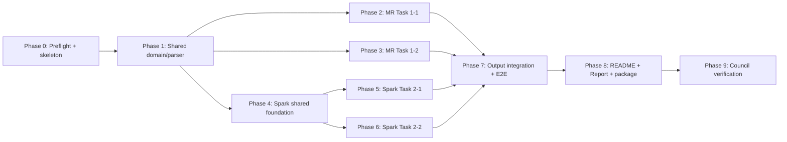

# Big Data Lab 3 — Implementation Checklist

> **References**:
> - [Detailed Goals](./spec-bigdata-lab3-detailed-goal.md)
> - [Detailed Design](./spec-bigdata-lab3-detailed-design.md)
> - [Main Spec](./spec-bigdata-lab3-inprocess.md)

## Context
Revision note 2026-08-12: the revised submission target removes the top-level `scripts/` directory, flattens task source roots to `src/Task_*` direct roots, and treats `docs/README.md` as the authoritative WSL-friendly runbook with `<user_name>` placeholders.
Note: after flattening the tree, update scripts and any source path references/CLI examples so they target the new locations, not the legacy `source` layout.

Đây là nguồn sự thật trung tâm trong phase Code Execution. Mỗi task phải được chuyển `[ ] → [/] → [x]`, chỉ đánh dấu hoàn tất sau khi test và acceptance criteria tương ứng qua. Mỗi work session phải cập nhật cả Execution Log bên dưới và `implementation-notes.md`; mọi design drift phải sửa Detailed Design trước khi tiếp tục code.

Không có database/PostgreSQL trong spec. Persistence verification áp dụng cho HDFS/local CSV/Parquet artefacts: write/read round-trip, failure-safe commit, exact filename/schema và cleanup có giới hạn.

## Approval Gate

> Không viết production code, README, report source hoặc scripts cho đến khi section này được người dùng xác nhận rõ.

- **Status**: Approved
- **Confirmed by**: Người dùng
- **Confirmation date**: 2026-08-10
- **Revision note (2026-08-12)**: Scope changed to require WSL-friendly README commands, flattened task source roots, and no top-level `scripts/` directory.
- **Notes / required revisions before code execution**: Người dùng trả lời “approved”. Actual environment vẫn phải qua Phase 0 compatibility gate.

## Sequencing Strategy

**Chosen strategy**: Hybrid — dựng foundation tối thiểu, giải rủi ro môi trường/CSV trước, sau đó triển khai hai nhánh MapReduce và Spark theo feature slices, cuối cùng tích hợp output/evidence/docs/package.

**Rationale**: Bốn task độc lập về business logic nhưng chia sẻ parser, output policy và submission contract. Spark version là rủi ro lớn nhất nên phải khóa ở Phase 0; sau Phase 1, các nhánh có thể tiến hành độc lập.

## Dependency Order



**Recommended execution order**: 0 → 1 → 2 → 3 → 4 → 5 → 6 → 7 → 8 → 9.

**Parallelizable phases**: Sau Phase 1, Phase 2, Phase 3 và Phase 4 có thể chạy song song; sau Phase 4, Phase 5 và Phase 6 có thể chạy song song. Trong một agent session nên giữ thứ tự khuyến nghị để checklist/notes dễ audit.

## LLM Agent — Skill Activation Per Phase

> [!IMPORTANT]
> Workspace hiện không có `.agents/skills/`. Không được bịa tên skill. Trước mỗi phase phải chạy lại `rg --files .agents` (nếu thư mục xuất hiện) và đọc skill phù hợp trước khi sửa file. Nếu vẫn không có, dùng các tài liệu “Read first” bắt buộc dưới đây.

| Phase | Skills to activate | Source files to read BEFORE modifying |
|---|---|---|
| 0: Preflight/skeleton | Không có skill cục bộ; kiểm tra lại `.agents/skills/` | `AGENTS.md`; `spec-rule.md`; `implementation-guide.md`; 3 tài liệu spec hiện tại |
| 1: Shared domain/parser | Không có skill cục bộ; kiểm tra lại | Detailed Goals Sec 2–3, 10–11; Design Sec 3.4, 5.1, 8 |
| 2: MR Task 1-1 | Không có skill cục bộ; kiểm tra lại | Design Sec 4.3, 5.2, 6.2, Decisions 2–3; toàn bộ source Phase 1 |
| 3: MR Task 1-2 | Không có skill cục bộ; kiểm tra lại | Design Sec 4.3, 5.3, 6.3, Decision 4; toàn bộ source Phase 1 |
| 4: Spark foundation | Không có skill cục bộ; kiểm tra lại | Design Sec 3.2–3.4, 4.6, 5.1, 5.6; build files và shared source |
| 5: Spark Task 2-1 | Không có skill cục bộ; kiểm tra lại | Design Sec 5.4, 5.6, 6.4, Decision 5; toàn bộ Spark foundation source |
| 6: Spark Task 2-2 | Không có skill cục bộ; kiểm tra lại | Design Sec 5.5, 5.7, 6.5, Decisions 6–7; toàn bộ Spark foundation source |
| 7: Output/E2E | Không có skill cục bộ; kiểm tra lại | Design Sec 5.8, 6.1–6.5, 8, 11; four task main classes |
| 8: Docs/package | Không có skill cục bộ; kiểm tra lại | PDF đề bài; Design Sec 5.6–5.8, 7, 10; evidence/output validation results |
| 9: Council verification | Không có skill cục bộ; kiểm tra lại | Goals, Design, checklist, implementation notes, all test/evidence summaries |

**Coding/process rules — read once before execution**:

- `AGENTS.md` — phase gates, continuous checklist/notes logging và SM/PO/Dev review.
- `llm-documents/specs-and-process/rules/spec-rule.md` — status/approval protocol.
- `llm-documents/specs-and-process/rules/implementation-guide.md` — per-task loop, quality gates và design-drift handling.
- Không có `backend-docs`, `frontend-docs` hoặc project-specific Scala coding rules trong workspace tại thời điểm lập checklist.

## Task Status Legend

- `[ ]` — Not started
- `[/]` — In progress
- `[x]` — Complete, đã implement/test/validate
- `[!]` — Blocked, phải ghi nguyên nhân

---

## Phase 0: Compatibility Gate và Project Skeleton

**Addresses**: R-GEN-01, R-GEN-02; khóa môi trường và build reproducibility.
**Design reference**: Sec 3.2, 4.5–4.6, 7, Decision 1.
**Files affected**: `bigdata-lab3/build.sbt`, `bigdata-lab3/project/build.properties`, `bigdata-lab3/project/plugins.sbt`, `bigdata-lab3/scripts/preflight.sh`, `implementation-notes.md`, main/spec references khi đổi status.
**Prerequisite**: Checklist Approval Gate phải Approved.
**Skill**: Không có `.agents/skills/*`; chạy lại discovery và ghi kết quả vào Execution Log.
**Read first**: `AGENTS.md` (FULL), `implementation-guide.md` (FULL), Detailed Goals/Design/Checklist (FULL).

**Tasks**:

- [x] 0.1 Bắt đầu execution đúng process
  - Đổi main spec `pending → inprocess`, cập nhật mọi relative links tham chiếu filename cũ.
  - Tạo `implementation-notes.md` với running sections: decisions, design deviations, trade-offs, surprises/gotchas.
  - Đánh dấu task đang làm `[ / ]` trước khi tạo production files và ghi Execution Log.
  - _Requirements: R-GEN-01_ — _Design: Sec 4.4, 15_
- [!] 0.2 Chạy và ghi compatibility preflight — workspace execution hiện không có Java/Scala/Hadoop/Spark/SBT/Bash trên PATH; target runtime version cần được xác nhận ngoài workspace.
  - Thu `java -version`, `scala -version`, `hadoop version`, `spark-submit --version`, `sbt --version`, HDFS/YARN health và filesystem paths.
  - Nếu Spark không phải 2.4.8/Scala 2.11-compatible, dừng Spark implementation, cập nhật Design/build decision trước khi tiếp tục; không ép dependency sai ABI.
  - _Requirements: R-GEN-01, R-GEN-02_ — _Design: Sec 3.2, 4.6, Decision 1_
- [x] 0.3 Tạo submission-oriented SBT skeleton
  - Cấu hình Scala 2.11.12, Hadoop 3.3.6/Spark baseline ở scope `provided`, Commons CSV, ScalaTest và assembly jar không bundle Hadoop/Spark.
  - Khai báo unmanaged source directories cho `src/common/source` và bốn `src/Task_*/source`; pin SBT/plugin versions tương thích Java 8.
  - _Requirements: R-GEN-01, R-SUB-02_ — _Design: Sec 4.6, 7.1_
  - Revised layout note: `src/Task_*` is the target direct task-root convention; treat older `src/Task_*/source` wording as legacy.
- [x] 0.4 Viết preflight script và smoke test build
  - Script chỉ đọc/kiểm tra môi trường, trả non-zero cùng hướng dẫn rõ khi mismatch/missing.
  - Chạy `sbt clean test`/assembly smoke; xác nhận JAR không chứa Spark/Hadoop classes provided.
  - _Requirements: R-GEN-01, R-GEN-02_ — _Design: Sec 7.2–7.5, 8.1_
- [x] 0.5 Thêm tests cho CLI/preflight parsing
  - Test required args, numeric constraints, URI validation và existing output policy ở mức pure logic; shell smoke cho success/failure nếu môi trường có tool.
  - _Requirements: R-GEN-01, R-GEN-02_ — _Design: Sec 7.2–7.5, 8.1_

**Acceptance Criteria**:

- [ ] Actual environment versions được lưu evidence và tương thích với build đã pin, hoặc Design được cập nhật/duyệt lại trước Spark code.
- [ ] `sbt test` và assembly smoke pass trên skeleton.
- [ ] Main spec mang trạng thái `inprocess`; checklist và `implementation-notes.md` bắt đầu được cập nhật liên tục.
- [ ] Không có Hadoop/Spark runtime jars bị đóng gói trùng trong assembly.

**Deliverables Created / Modified**:

- `bigdata-lab3/build.sbt`, `bigdata-lab3/project/*` — reproducible build.
- `bigdata-lab3/scripts/preflight.sh` — environment gate.
- `implementation-notes.md` — running execution notes.
- `spec-bigdata-lab3-inprocess.md` và links — execution status.

---

## Phase 1: Shared Domain, CSV Parsing và Normalization

**Addresses**: R-GEN-01; R-MR-11-01/03; R-MR-12-01; R-SP-21-01/02/03; R-SP-22-01/02.
**Design reference**: Sec 3.4, 5.1, 6.0–6.1, 8.2, Decision 2.
**Files affected**: `bigdata-lab3/src/common/source/lab3/common/{SaleRow.scala,Normalization.scala,SaleRowParser.scala,DataError.scala,Cli.scala}`, `bigdata-lab3/src/test/scala/lab3/common/*Spec.scala`, fixture CSVs.
**Prerequisite**: Phase 0.
**Skill**: Không có local skill; re-run discovery.
**Read first**: Design Sec 5.1 và 8.2 (FULL); current build files (FULL).

**Tasks**:

- [x] 1.1 Tạo immutable domain/error contracts
  - Implement `SaleRow`, `DataError`, CLI config case classes; không thêm fields ngoài schema/design nếu không ghi notes.
  - _Requirements: R-GEN-01_ — _Design: Sec 5.1, 6.0, 8.1_
- [x] 1.2 Implement robust Commons CSV row parser
  - Parse 24-column header contract observed in the supplied CSV, quoted promotion lists, strict `MM-dd-yy`, Long/Double optional values và record ID.
  - Header chỉ bị skip ở file offset 0; structural errors fail rõ, record errors có typed reason.
  - _Requirements: R-GEN-01, R-MR-11-01_ — _Design: Sec 3.4, 5.1, 8.1–8.2_
- [x] 1.3 Implement normalization/business primitives
  - Trim/collapse whitespace/uppercase Locale.ROOT; `isBought`; `isAtLeastXXL`; distinct promotion tokens; month/date format.
  - Không coerce Amount null thành 0; tách exact label matching khỏi contains-SHIPPED rule.
  - _Requirements: R-MR-11-01, R-MR-12-01, R-SP-21-01/02/03, R-SP-22-01/02_ — _Design: Sec 5.1, 8.2_
- [x] 1.4 Tạo hand-calculated fixture library
  - Tiny CSVs cho quoting, nulls, duplicate order IDs, promotion boundaries, size aliases, city/state normalization và invalid rows.
  - Ghi expected records/metrics bằng Markdown hoặc Scala fixtures cạnh tests.
  - _Requirements: R-GEN-01_ — _Design: Sec 11.2_
- [x] 1.5 Unit test parser và normalization
  - Bao phủ valid/invalid dates/numerics, embedded comma, empty tokens, duplicate promotion, shipped predicate, size ≥XXL và locale-stable output.
  - _Requirements: R-GEN-01, R-MR-11-01, R-MR-12-01, R-SP-21-01, R-SP-22-01_ — _Design: Sec 11.1–11.2_

**Acceptance Criteria**:

- [x] Mỗi dòng fixture parse thành đúng `SaleRow` hoặc đúng typed error.
- [x] Parser không dùng `String.split(",")` cho CSV record.
- [x] Bought/size/promotion/null semantics khớp Design và tests.
- [x] `sbt test` pass; không có warning compile mới không được giải thích.

**Deliverables Created / Modified**:

- `src/common/source/lab3/common/*` — shared contracts/parser.
- `src/test/scala/lab3/common/*` và `src/test/resources/fixtures/*` — logic tests.

---

## Phase 2: MapReduce Task 1-1 — Dynamic Sliding Window

**Addresses**: R-MR-11-01 đến R-MR-11-04.
**Design reference**: Sec 4.3 Task 1-1, 5.2, 6.2, 9.1, Decisions 2–3/8.
**Files affected**: `bigdata-lab3/src/Task_1-1/source/lab3/task11/*.scala`, `bigdata-lab3/src/common/source/lab3/common/CsvEncoding.scala`, `bigdata-lab3/src/common/source/lab3/io/SingleFileExporter.scala`, `src/test/scala/lab3/task11/*Spec.scala`.
**Prerequisite**: Phase 1.
**Skill**: Không có local skill; re-run discovery.
**Read first**: Common source (FULL), Design Sec 5.2/6.2/10 Decisions 2–3 (FULL).

**Tasks**:

- [x] 2.1 Implement `Moment` accumulator và winner comparator
  - Associative `combine`, frequency/all-rows, amountCount/sum/sumSquares, variance clamp và undefined variance ordering.
  - Comparator: frequency desc → finite variance asc → lexicographical size asc.
  - _Requirements: R-MR-11-03_ — _Design: Sec 5.2, 6.2_
- [x] 2.2 Implement Job A state bought counts
  - Mapper/combiner/reducer với counters cho rows/bought/rejected; output state→total.
  - Driver đọc small result và xác định 5 ngày khi `>10000`, còn lại 10.
  - _Requirements: R-MR-11-01_ — _Design: Sec 5.2_
- [x] 2.3 Implement Job B map-to-buckets và local combine
  - Mỗi bought row t emit `(state,t+i,size)` cho `i=1..w`; serialize composite key và `MomentWritable` deterministically.
  - Combiner chỉ dùng associative combine; reducer emit candidate stats.
  - _Requirements: R-MR-11-02, R-MR-11-03_ — _Design: Sec 4.3, 5.2, Decision 3_
- [x] 2.4 Implement Job C winner và CSV row contract
  - Group `(state,window_date)`, áp comparator, emit ordered columns không header vào temp output.
  - Cấu hình one reducer cho lab final stage; output ordering deterministic.
  - _Requirements: R-MR-11-03, R-MR-11-04_ — _Design: Sec 5.2, 6.2_
- [x] 2.5 Implement `Task11Main` orchestration/failure cleanup
  - CLI paths/reducers/overwrite; run Job A→B→C; chỉ tiếp tục khi prior job success; scoped temp paths.
  - Log Hadoop counters cần cho shuffle/time complexity report.
  - _Requirements: R-MR-11-02, R-MR-11-04_ — _Design: Sec 5.2, 7.2, 8.3, 9.1_
- [x] 2.6 Unit test boundaries, buckets và tie-breaks
  - Exactly 10.000/10.001, `[d-w,d-1]`, max-date+window, frequency ties, lower/undefined/one-value variance và lexical tie.
  - _Requirements: R-MR-11-01/02/03_ — _Design: Sec 11.2_
- [!] 2.7 Run Hadoop local-mode integration fixture — blocked trong workspace Windows vì Hadoop 3.3.6 gọi native Windows API; test được giữ để chạy thật trên Linux/Lab 1 và tự `cancel` có lý do trên Windows.
  - Chạy ba jobs trên tiny CSV, assert exact rows/schema/logical keys/counters; test job failure không commit final.
  - _Requirements: R-MR-11-01 đến R-MR-11-04_ — _Design: Sec 11.1–11.3_

**Acceptance Criteria**:

- [ ] Fixture map-to-buckets và winner output khớp phép tính tay.
- [ ] Combiner không thay đổi kết quả khi bật/tắt trong test.
- [ ] Task sinh dates không có trong input và đúng maxDate+w policy.
- [ ] Counters đủ để report raw map output, combine reduction và shuffle evidence.
- [ ] Unit/local integration tests pass.

**Deliverables Created / Modified**:

- `src/Task_1-1/source/lab3/task11/*` — three-job MR pipeline.
- `src/test/scala/lab3/task11/*` — unit/local integration tests.

---

## Phase 3: MapReduce Task 1-2 — Median Variety

**Addresses**: R-MR-12-01 đến R-MR-12-03.
**Design reference**: Sec 4.3 Task 1-2, 5.3, 6.3, Decision 4.
**Files affected**: `bigdata-lab3/src/Task_1-2/source/lab3/task12/*.scala`, `src/test/scala/lab3/task12/*Spec.scala`.
**Prerequisite**: Phase 1.
**Skill**: Không có local skill; re-run discovery.
**Read first**: Common source (FULL), Design Sec 5.3/6.3/Decision 4 (FULL).

**Tasks**:

- [x] 3.1 Implement exact median pure function
  - Odd/even behavior, Double output, empty input typed error/not emitted.
  - _Requirements: R-MR-12-02_ — _Design: Sec 5.3_
- [x] 3.2 Implement Job A variety per style
  - Bought filter; key `(state,month,style)`; reducer distinct SKU + OR `isAtLeastXXL`; emit only qualifying styles.
  - Add counters for missing fields/non-bought/qualifying styles.
  - _Requirements: R-MR-12-01_ — _Design: Sec 4.3, 5.3, Decision 4_
- [x] 3.3 Implement Job B state-month median
  - Group `(state,month)`, exact sort/median, qualifying style count và deterministic output.
  - _Requirements: R-MR-12-02, R-MR-12-03_ — _Design: Sec 5.3, 6.3_
- [x] 3.4 Implement `Task12Main` orchestration
  - CLI/work/output policies; Job A→B gating; temp cleanup; counters/evidence.
  - _Requirements: R-MR-12-03_ — _Design: Sec 7.3, 8.1–8.3_
- [x] 3.5 Unit test variety, size aliases và median
  - Duplicate SKU, same SKU across styles, XXL/2XL/XXXL/3–6XL/Free/unknown, month boundary, odd/even/empty.
  - _Requirements: R-MR-12-01/02_ — _Design: Sec 11.2_
- [!] 3.6 Run Hadoop local-mode integration fixture — test chạy thật trên Linux/Lab 1 nhưng bị `cancel` có lý do trong workspace Windows thiếu native Hadoop.
  - Assert exact `state,month,median_variety,qualifying_style_count`; verify cancelled/Qty0 excluded.
  - _Requirements: R-MR-12-01 đến R-MR-12-03_ — _Design: Sec 11.1–11.3_

**Acceptance Criteria**:

- [ ] Variety dùng distinct SKU và chỉ style bought có ít nhất một size ≥XXL.
- [ ] Median odd/even khớp fixture tính tay.
- [ ] Group không qualifying style không xuất hiện.
- [ ] Unit/local integration tests pass.

**Deliverables Created / Modified**:

- `src/Task_1-2/source/lab3/task12/*` — two-job MR pipeline.
- `src/test/scala/lab3/task12/*` — unit/local integration tests.

---

## Phase 4: Spark Structured API Foundation và Evidence Hooks

**Addresses**: R-GEN-01; R-SP-21-01/04; R-SP-22-01/03.
**Design reference**: Sec 3.2–3.4, 5.1, 5.6, 8.3, Decision 1/7.
**Files affected**: `bigdata-lab3/src/common/source/lab3/spark/{SparkSaleReader.scala,PromotionFrames.scala,PlanEvidence.scala,StageCollector.scala}.scala`, Spark test support.
**Prerequisite**: Phase 1 và Phase 0 compatibility gate đã pass.
**Skill**: Không có local skill; re-run discovery.
**Read first**: Actual build/version evidence, shared domain source, Design Sec 5.1/5.6/Decision 7 (FULL).

**Tasks**:

- [x] 4.1 Implement explicit Spark schema và normalized base DataFrame
  - CSV reader header/quote/escape/mode; select only required columns; UTC timezone; normalized dimensions/date/record_id/amount/qty.
  - Không dùng schema inference và không gọi `spark.sql`.
  - _Requirements: R-GEN-01, R-SP-21-04_ — _Design: Sec 5.1, 9.4_
- [x] 4.2 Implement promotion-token DataFrames
  - Split/trim/filter/distinct token per record; preserve Amazon promotions; empty→count 0.
  - Reusable frames cho lifespan và per-record promotion count.
  - _Requirements: R-SP-21-01, R-SP-22-01_ — _Design: Sec 5.1, 5.4–5.5_
- [x] 4.3 Implement data-quality metrics
  - Counts for invalid/null fields, duplicate order IDs, date range, SKU-month max; bounded samples only.
  - _Requirements: R-SP-21-01/02, R-SP-22-01/05_ — _Design: Sec 3.4, 8.2–8.3_
- [x] 4.4 Implement extended plan và stage collector
  - Capture query execution text, invoke `explain(true)`, identify join node names/Exchange nodes, collect unique stage IDs per job group.
  - Tests dùng synthetic query với known join/exchange patterns nhưng không hard-code optimizer strategy cho production input.
  - _Requirements: R-SP-21-04_ — _Design: Sec 5.6_
- [x] 4.5 Enforce Structured API-only source rule
  - Add test/static scan failing on `spark.sql(` in Task 2 source; allow documented `functions.expr("percentile_approx...")` only at one reviewed location.
  - _Requirements: R-GEN-01, R-SP-21-04, R-SP-22-03_ — _Design: Decision 7_
- [x] 4.6 Run Spark `local[2]` foundation integration tests
  - Read quoted fixture, validate schema/tokens/metrics/plan capture/stage collector and deterministic normalized rows.
  - _Requirements: R-SP-21-01/04, R-SP-22-01_ — _Design: Sec 11.1–11.2_

**Acceptance Criteria**:

- [ ] Actual Spark/Scala ABI matches compiled artifact.
- [x] No direct Spark SQL query exists.
- [x] Promotion tokens and data-quality metrics match fixtures/full-input profile baseline.
- [x] Extended plan, join names, Exchange count và stage IDs can be persisted as evidence.
- [x] Spark foundation tests pass on `local[2]`.

**Deliverables Created / Modified**:

- `src/common/source/lab3/spark/*` — Spark input/promotion/evidence foundation.
- `src/test/scala/lab3/spark/*` — local Spark integration/static rule tests.

---

## Phase 5: Spark Task 2-1 — Cancelled Standard Percentage

**Addresses**: R-SP-21-01 đến R-SP-21-04.
**Design reference**: Sec 4.3 Spark flow, 5.4, 5.6, 6.4, Decision 5.
**Files affected**: `bigdata-lab3/src/Task_2-1/source/lab3/task21/{Task21Job.scala,Task21Main.scala}.scala`, tests/fixtures.
**Prerequisite**: Phase 4.
**Skill**: Không có local skill; re-run discovery.
**Read first**: Spark foundation source (FULL), Design Sec 5.4/5.6/6.4/Decision 5 (FULL).

**Tasks**:

- [x] 5.1 Build promotion lifespan/validity relation
  - Per unique token toàn dataset: min/max date, `datediff >=2`; join/count distinct valid promotions per record.
  - _Requirements: R-SP-21-01_ — _Design: Sec 5.4_
- [x] 5.2 Build merchant-shipped state averages
  - Exact normalized Merchant + Courier Shipped, valid Amount only, average per state; test no-average state.
  - _Requirements: R-SP-21-02_ — _Design: Sec 5.4_
- [x] 5.3 Build denominator/numerator và percentage
  - Denominator Cancelled Standard per `(state,city)`; numerator adds promo≥3, Amount<state average; retain rows with numerator 0.
  - Output exact Sec 6.4 schema, percentage Double in [0,100].
  - _Requirements: R-SP-21-03_ — _Design: Sec 5.4, 6.4, Decision 5_
- [x] 5.4 Wire Task21 CLI, evidence capture và output handoff
  - Apply job group, plan before/after action, stage/Exchange/join summary; no join hints unless Design is updated from observed need.
  - _Requirements: R-SP-21-04_ — _Design: Sec 5.6, 7.4_
- [x] 5.5 Unit/integration test hand-calculated query
  - Promotion 1/2-day boundary, Amazon/duplicates, missing state average, null amount, duplicate city names, zero numerator and exact percentage.
  - _Requirements: R-SP-21-01/02/03_ — _Design: Sec 11.2_
- [x] 5.6 Validate plan/stage evidence fixture
  - Evidence contains extended plan, actual join strategy names, exact Exchange count và stage IDs with measurement context.
  - _Requirements: R-SP-21-04_ — _Design: Sec 5.6, 8.3_

**Acceptance Criteria**:

- [x] Fixture output matches manual numerator/denominator/percentage.
- [x] All promotions including Amazon are eligible; temporal validity is global.
- [x] Output groups by state+city and satisfies Sec 6.4 schema/invariants.
- [x] Evidence is sufficient to fill all mandatory Task 2-1 Report analysis.
- [ ] No `spark.sql` query; all Spark tests pass.

**Deliverables Created / Modified**:

- `src/Task_2-1/source/lab3/task21/*` — DataFrame pipeline/main.
- `src/test/scala/lab3/task21/*` — query/evidence tests.

---

## Phase 6: Spark Task 2-2 — Approximate vs Exact Percentiles

**Addresses**: R-SP-22-01 đến R-SP-22-06, R-GEN-03.
**Design reference**: Sec 4.3, 5.5, 5.7, 6.5, Decisions 6–7.
**Files affected**: `bigdata-lab3/src/Task_2-2/source/lab3/task22/{Task22Job.scala,BenchmarkHarness.scala,Task22Main.scala}.scala`, tests/fixtures.
**Prerequisite**: Phase 4.
**Skill**: Không có local skill; re-run discovery.
**Read first**: Spark foundation source (FULL), Design Sec 5.5/5.7/6.5/Decisions 6–7 (FULL).

**Tasks**:

- [x] 6.1 Build reusable SKU-month base
  - Valid SKU/date, record_id, promotion count, Amount; profile row/group counts and max group size.
  - _Requirements: R-SP-22-01, R-SP-22-05_ — _Design: Sec 5.5_
- [x] 6.2 Implement built-in approximate P80/P90
  - One reviewed `groupBy.agg(expr(percentile_approx...))` location, default accuracy 10000, explode thresholds.
  - Validate accuracy option positive; no custom approximation and no SQL query.
  - _Requirements: R-SP-22-03_ — _Design: Sec 5.5, Decision 7_
- [x] 6.3 Implement exact nearest-rank P80/P90
  - Window order `(promotion_count,record_id)`, `rank=ceil(p*N)`, select observed count; no approximate fallback.
  - _Requirements: R-SP-22-03_ — _Design: Sec 5.5, Decision 6_
- [x] 6.4 Build qualifying sets/stddev output
  - Filter `count>=threshold`; emit approx+exact × P80/P90; count all qualifying rows and non-null Amount values; explicit <2/empty-amount zero rule.
  - Output exact Sec 6.5 schema/invariants.
  - _Requirements: R-SP-22-02, R-SP-22-06_ — _Design: Sec 5.5, 6.5_
- [x] 6.5 Implement threshold/qualifying-set comparison artefacts
  - Threshold deltas per group/level; left-anti both directions on record_id; group summaries and bounded examples.
  - _Requirements: R-SP-22-04_ — _Design: Sec 5.5_
- [x] 6.6 Implement fair benchmark harness
  - Same cached/materialized base, one warm-up, 5 measured runs each in alternating order, forced equivalent actions; raw CSV + arithmetic mean + sample SD.
  - Unit test mean/sample-SD math and `runs>=5` validation.
  - _Requirements: R-GEN-03, R-SP-22-04_ — _Design: Sec 5.7_
- [x] 6.7 Implement group-size/partition evidence
  - Record group >1.000 count, maximum rows and estimated group bytes; current data expected zero >1.000/max 426.
  - Report input includes 128 MB comparison and reason no manual group repartition.
  - _Requirements: R-SP-22-05_ — _Design: Sec 3.4, 5.5, 9.3_
- [x] 6.8 Wire Task22 CLI/evidence/output handoff
  - Input/output/evidence/accuracy/runs/overwrite config; clean lifecycle and non-zero failures.
  - _Requirements: R-SP-22-04/05/06_ — _Design: Sec 7.5, 8.1_
- [x] 6.9 Unit/integration test percentile boundaries và set differences
  - N=1/2/5/10, duplicate counts, threshold equality, 0/1 qualifying, null Amount, approximate/exact differences and schema.
  - _Requirements: R-SP-22-01 đến R-SP-22-06_ — _Design: Sec 11.2_

**Acceptance Criteria**:

- [x] Exact thresholds equal hand-calculated nearest-rank fixtures.
- [x] Approx path uses Spark built-in and contains no direct SQL query.
- [x] Final result has four rows per valid SKU-month (2 methods × 2 levels) with unique keys.
- [x] Benchmark has 5 raw samples/method, mean and sample standard deviation.
- [x] Group-size evidence correctly reports conditional >1.000 requirement.
- [x] Spark Task 2-2 tests pass.

**Deliverables Created / Modified**:

- `src/Task_2-2/source/lab3/task22/*` — percentile/comparison/benchmark pipeline.
- `src/test/scala/lab3/task22/*` — logic/local integration tests.

---

## Phase 7: Single-file Export, Validation và Full-data E2E

**Addresses**: R-MR-11-04, R-MR-12-03, R-SP-21-04, R-SP-22-06, R-SUB-02.
**Design reference**: Sec 5.8, 6.1–6.5, 8, 11.3–11.4, Decision 8.
**Files affected**: `bigdata-lab3/src/common/source/lab3/io/{SingleFileExporter.scala,OutputValidator.scala}.scala`, `scripts/run-all.sh`, `scripts/validate-outputs.sh`, exporter/E2E tests.
**Prerequisite**: Phases 2, 3, 5, 6.
**Skill**: Không có local skill; re-run discovery.
**Read first**: Four task source trees (FULL), Design Sec 5.8/6/8/11 (FULL).

**Tasks**:

- [x] 7.1 Implement failure-safe CSV exporter
  - Merge only `part-*` in deterministic order, header once, UTF-8 temp write + close + atomic/best-effort move; exact Task filenames.
  - Reject unexpected/missing parts, protect cleanup scope và existing target without `--overwrite`.
  - _Requirements: R-MR-11-04, R-MR-12-03_ — _Design: Sec 5.8, 6.2–6.3, Decision 8_
- [x] 7.2 Implement failure-safe Parquet exporter
  - Coalesce only final aggregate, temp directory, exactly one parquet part, move to exact file, schema read-back before commit.
  - _Requirements: R-SP-21-04, R-SP-22-06_ — _Design: Sec 5.8, 6.4–6.5, Decision 8_
- [x] 7.3 Implement output validators
  - CSV headers/logical-key uniqueness/value invariants; Parquet exact schema, key multiplicity, range/finite/count invariants.
  - _Requirements: R-MR-11-04, R-MR-12-03, R-SP-21-04, R-SP-22-06_ — _Design: Sec 5.8, 11.3_
- [!] 7.4 Test exporter round-trips/failures — CSV invariant tests pass; Hadoop-backed CSV/Parquet write round-trips are retained for Linux/Lab 1 but unavailable on Windows native filesystem.
  - Multiple CSV parts/header once, zero/multiple Parquet parts, existing target, simulated invalid schema và final-preservation on failure.
  - _Requirements: R-MR-11-04, R-MR-12-03, R-SP-21-04, R-SP-22-06_ — _Design: Sec 11.4_
- [x] 7.5 Create deterministic run-all/validation scripts
  - HDFS upload/work cleanup scoped to lab path, four main invocations, stop-on-failure, final validation and evidence paths.
  - Không tự xóa broad HDFS/local directories; require explicit input/output/work args.
  - _Requirements: R-GEN-02, R-SUB-02_ — _Design: Sec 4.4–4.5, 7_
- [!] 7.6 Run full-data MapReduce E2E — cần pseudo-distributed Hadoop Lab 1 không có trong workspace.
  - Execute Task 1-1/1-2 on pseudo-distributed Hadoop with supplied CSV; capture counters/timing/logs; validate exact CSVs.
  - _Requirements: R-MR-11-01 đến R-MR-11-04, R-MR-12-01 đến R-MR-12-03_ — _Design: Sec 11.3_
- [!] 7.7 Run full-data Spark E2E — cần target `spark-submit` và Hadoop-compatible local filesystem không có trong workspace.
  - Execute Task 2-1/2-2 in target Spark local mode; capture plan/stages/benchmark/profile; validate exact Parquets.
  - _Requirements: R-SP-21-01 đến R-SP-21-04, R-SP-22-01 đến R-SP-22-06, R-GEN-03_ — _Design: Sec 11.3_
- [!] 7.8 Cross-check full-data invariants và independent read-back — phụ thuộc outputs thật từ 7.6–7.7.
  - Confirm row/date/null baseline or document input drift; open Parquet with Spark local; record checksum/size/schema/row counts of all outputs.
  - _Requirements: R-SUB-02_ — _Design: Sec 9.4, 11.3–11.4_

**Acceptance Criteria**:

- [ ] Có đúng bốn local physical files với exact names; không nộp output directories/part files.
- [ ] All schemas, keys và invariants pass validators.
- [ ] Failed export never corrupts/replaces previously valid final file.
- [ ] Full-data MR/Spark jobs exit 0 và evidence đủ cho Report.

**Deliverables Created / Modified**:

- `src/common/source/lab3/io/*` — exporters/validators.
- `scripts/run-all.sh`, `scripts/validate-outputs.sh` — reproducible E2E.
- Four validated outputs + evidence logs (generated, không commit nếu quá lớn).

---

## Phase 8: Vietnamese README, Report và Submission Packaging

**Addresses**: R-GEN-02/03, R-MR-11-04, R-MR-12-03, R-SP-21-04, R-SP-22-04/05/06, R-SUB-01/02.
**Design reference**: Sec 5.6–5.8, 7.1/7.6, 9.4, Decision 8–9.
**Files affected**: `bigdata-lab3/docs/{README.md,Report.md,Report.pdf,drive_link.txt}`, `docs/evidence/*`, `scripts/package-submission.sh`, docs/package tests.
**Prerequisite**: Phase 7.
**Skill**: Không có local skill; re-run discovery.
**Read first**: PDF đề (FULL), verified outputs/evidence, Goals report/submission requirements, Design Sec 5.6–5.8/7 (FULL).

**Tasks**:

- [x] 8.1 Viết README tiếng Việt terminal-first
  - README must be a WSL-friendly runbook with `<user_name>` / `$HOME` placeholders and a single ordered flow from install -> config -> build -> run -> validate -> package.
  - Prerequisites/version checks; build; HDFS/YARN; input upload; từng task command; output retrieval; validation; full run; packaging.
  - Mỗi code block có chú thích ngắn, expected output và troubleshooting cho path/version/output exists.
  - _Requirements: R-GEN-02_ — _Design: Sec 5.8, 7.2–7.5, 8.1_
- [x] 8.2 Viết Report phần Task 1-1
  - Query framing/decomposition/reasoning; bucket mapping; complexity `O(n*w)` vs repeated scans; actual shuffle counters; tie-break justification; result/test evidence.
  - _Requirements: R-MR-11-04, R-SUB-01_ — _Design: Sec 5.2, 9.1_
- [x] 8.3 Viết Report phần Task 1-2
  - Purchased-row assumption, decomposition, distinct SKU/style, ≥XXL normalization, exact median và evidence.
  - _Requirements: R-MR-12-03, R-SUB-01_ — _Design: Sec 5.3, Decision 4_
- [!] 8.4 Viết Report phần Task 2-1 — phương pháp/local evidence đã viết; actual full-data join/Exchange/stage values chờ Lab 1.
  - Query framing/decomposition, denominator assumption, full `explain(true)` output, actual physical joins, Exchange count, stage count và interpretation.
  - _Requirements: R-SP-21-04, R-SUB-01_ — _Design: Sec 5.4, 5.6, Decision 5_
- [!] 8.5 Viết Report phần Task 2-2 — phương pháp đã viết; comparison/5-run/full profile values chờ Lab 1.
  - Exact nearest-rank formula, approximate accuracy, threshold/set differences, 5-run timing table mean/sample SD, group>1.000 result, 128 MB analysis và partition decision.
  - _Requirements: R-GEN-03, R-SP-22-04/05/06, R-SUB-01_ — _Design: Sec 5.5, 5.7, Decisions 6–7_
- [!] 8.6 Tạo và kiểm tra `Report.pdf` — đã tạo draft PDF mở/hiển thị tốt; chưa thể coi là final khi còn marker full-data evidence.
  - Chọn deterministic available converter, giữ `Report.md` source; open/read PDF, verify fonts/tables/code/plan không bị cắt và mọi required section có mặt.
  - _Requirements: R-SUB-01_ — _Design: Sec 5.8_
- [!] 8.7 Implement submission packaging validator/script — script hoàn tất và RepresentativeID=`23127442`; final invocation còn cần Drive URL và bốn output thật.
  - Require `--representative-id`, `--drive-url`, four verified outputs; generate one-line `drive_link.txt`; create exact tree và `<ID>.zip` with one root folder.
  - Reject placeholder/invalid HTTPS URL/missing Report/output; không upload hoặc submit tự động.
  - _Requirements: R-SUB-02_ — _Design: Sec 7.1, 7.6_
- [!] 8.8 Test docs và package structure — docs draft đã kiểm tra; unzip/full package test phụ thuộc external inputs và outputs.
  - Static checklist for README commands/Report topics; unzip to temp and assert exact required paths/names; verify Drive folder manifest contains four output names.
  - _Requirements: R-GEN-02, R-SUB-01, R-SUB-02_ — _Design: Sec 7.1, 11.1_

**Acceptance Criteria**:

- [ ] README hoàn toàn bằng tiếng Việt, từng bước terminal có chú thích dễ hiểu.
- [ ] Report.pdf mở được và phủ mọi report requirement chuyên biệt.
- [ ] Package script không chạy khi thiếu RepresentativeID/Drive URL/four validated outputs.
- [ ] ZIP structure validator pass và `drive_link.txt` đúng một URL.
- [ ] `shapes.parquet(legacy)` không xuất hiện trong submission.

**Deliverables Created / Modified**:

- `docs/README.md`, `docs/Report.md`, `docs/Report.pdf`, `docs/drive_link.txt`.
- `docs/evidence/*` — report inputs/logs.
- `scripts/package-submission.sh` — validated packaging.

---

## Phase 9: Final Council Verification và Spec Completion

**Addresses**: Toàn bộ R-GEN, R-MR, R-SP, R-SUB; final correctness/process gate.
**Design reference**: Sec 11–15.
**Files affected**: checklist, `implementation-notes.md`, main spec `inprocess→complete`, design/goals nếu correction cần thiết.
**Prerequisite**: Phase 8 và external RepresentativeID/Drive URL có sẵn để tạo final package; nếu chưa có chỉ package completion bị blocked.
**Skill**: Không có local skill; re-run discovery.
**Read first**: All spec docs, implementation notes, full test/evidence summaries, final file manifest.

**Tasks**:

- [!] 9.1 SM process review — checklist/notes/approvals đã audit; còn các task target/external được ghi blocker.
  - Confirm every task status/evidence/log, no skipped approvals, Design/Checklist synchronized, implementation notes complete và no unresolved design drift.
  - _Requirements: R-SUB-01/02_ — _Design: Sec 14–15_
- [!] 9.2 PO acceptance review — logic/UX/docs draft đạt; bốn output thật và final Report/package chưa có.
  - Walk every Detailed Goal AC, four output validators, README usability, Report completeness và submission UX.
  - _Requirements: All_ — _Design: Sec 12_
- [!] 9.3 Dev quality/safety review — clean test/assembly/source scan pass; target E2E chưa chạy.
  - Clean build/test/E2E, dependency/source scan, no debug/secrets/broad cleanup, code comments, deterministic output và evidence reproducibility.
  - _Requirements: R-GEN-01/02/03_ — _Design: Sec 8–11_
- [!] 9.4 Finalize artefacts và spec status — giữ `inprocess` đúng quy trình đến khi Lab 1 E2E + ID/URL/package pass.
  - Run clean package validation; record final checksums/commands/results; complete review/retrospective sections.
  - Chỉ khi tất cả AC pass: đổi main `inprocess→complete`, cập nhật links và checklist Execution Log.
  - _Requirements: R-SUB-01/02_ — _Design: Sec 4.4, 7.6_

**Acceptance Criteria**:

- [ ] SM: checklist, notes, logs và approvals đầy đủ.
- [ ] PO: mọi AC và grading deliverable có evidence pass.
- [ ] Dev: clean build/tests/full runs/package validator pass; source sạch và an toàn.
- [ ] Main spec chỉ mang `complete` sau khi không còn required work.

**Deliverables Created / Modified**:

- Completed checklist/execution log và implementation notes.
- `spec-bigdata-lab3-complete.md` với Review/Retrospective.
- Validated `<RepresentativeID>.zip` và Drive upload manifest.

---

## Files Changed Summary

| Planned file/path | Phase(s) | Changes |
|---|---|---|
| `bigdata-lab3/build.sbt`, `project/*` | 0 | Scala/Hadoop/Spark/test/assembly build |
| `bigdata-lab3/scripts/preflight.sh` | 0 | Version/runtime gate |
| `implementation-notes.md` | 0–9 | Continuous decisions/gotchas/drift log |
| `src/common/source/lab3/common/*` | 1 | Domain/parser/normalization/CLI |
| `src/Task_1-1/source/lab3/task11/*` | 2 | Three-job sliding-window MapReduce |
| `src/Task_1-2/source/lab3/task12/*` | 3 | Two-job median-variety MapReduce |
| `src/common/source/lab3/spark/*` | 4 | Spark reader/promotions/plan/stage foundation |
| `src/Task_2-1/source/lab3/task21/*` | 5 | City percentage DataFrame job |
| `src/Task_2-2/source/lab3/task22/*` | 6 | Percentile/comparison/benchmark job |
| `src/common/source/lab3/io/*` | 7 | Single-file exporters/validators |
| `src/test/scala/**`, `src/test/resources/**` | 0–7 | Unit/local integration/export tests |
| `scripts/run-all.sh`, `validate-outputs.sh` | 7 | Full-data execution/validation |
| `docs/README.md` | 8 | Vietnamese terminal guide |
| `docs/Report.md`, `Report.pdf`, `evidence/*` | 8 | Required analysis/evidence/report |
| `docs/drive_link.txt`, `scripts/package-submission.sh` | 8 | Submission packaging contract |
| Spec files/checklist | 0–9 | Status, execution log, review, retrospective |

**Estimated changes**: khoảng 2.500–3.500 dòng source/test/scripts/docs trên khoảng 35–50 files, chưa tính generated evidence, outputs và PDF binary.

## Requirements Coverage Matrix

| Detailed Goal / Requirement | Covered by tasks | Verified by |
|---|---|---|
| R-GEN-01 | 0.2–0.5, 1.1–1.5, 4.1/4.5 | 0.4/0.5, 1.5, 4.5/4.6, 9.3 |
| R-GEN-02 | 0.2/0.4, 7.5, 8.1/8.8 | Preflight smoke, README walkthrough, package docs test |
| R-GEN-03 | 6.6, 7.7, 8.5 | Benchmark math test + 5 full-data samples/method |
| R-MR-11-01 | 1.3, 2.2, 2.6 | Boundary unit + local/full E2E |
| R-MR-11-02 | 2.3, 2.5, 2.6 | Bucket fixture + local/full E2E |
| R-MR-11-03 | 2.1, 2.3/2.4, 2.6 | Moment/comparator unit + integration |
| R-MR-11-04 | 2.4/2.5/2.7, 7.1/7.3/7.6, 8.2 | CSV validator + counters + Report review |
| R-MR-12-01 | 1.3, 3.2, 3.5/3.6 | Variety/size fixture + E2E |
| R-MR-12-02 | 3.1/3.3/3.5 | Odd/even median tests |
| R-MR-12-03 | 3.4/3.6, 7.1/7.3/7.6, 8.3 | CSV validator + Report review |
| R-SP-21-01 | 1.3, 4.2, 5.1/5.5 | Promotion fixture + Spark integration |
| R-SP-21-02 | 5.2/5.5 | State average/null tests |
| R-SP-21-03 | 5.3/5.5 | Manual percentage fixture + invariants |
| R-SP-21-04 | 4.4/4.5, 5.4/5.6, 7.2/7.3/7.7, 8.4 | Source scan, plan/stage evidence, Parquet validator |
| R-SP-22-01 | 1.3, 4.2, 6.1/6.9 | Promotion/group fixture + profile |
| R-SP-22-02 | 6.4/6.9 | Threshold/stddev fixture + schema invariants |
| R-SP-22-03 | 4.5, 6.2/6.3/6.9 | Source scan + exact/approx tests |
| R-SP-22-04 | 6.5/6.6/6.9, 7.7, 8.5 | Comparison artefacts + benchmark validation |
| R-SP-22-05 | 4.3, 6.1/6.7, 8.5 | Full-data profile max/group count evidence |
| R-SP-22-06 | 6.4/6.8/6.9, 7.2/7.3/7.7, 8.5 | Parquet read-back/schema + Report review |
| R-SUB-01 | 8.2–8.6/8.8, 9.1/9.2 | Report static/open/content review |
| R-SUB-02 | 0.3, 7.5/7.8, 8.7/8.8, 9.4 | Unzip tree validator + exact file manifest |

> Mọi Detailed Goal ID đều xuất hiện ít nhất một lần và có logic/integration/E2E hoặc documentation verification tương ứng.

## Deferred Items Reference

| ID | Issue | Effort | Dependency/trigger |
|---|---|---|---|
| D1 | Spark version adaptation | 2–8h tùy version | Actual `spark-submit --version`; update Design trước source |
| D2 | Drive URL/deadline | External input | RepresentativeID đã chốt là `23127442`; người dùng cung cấp Drive URL trước Phase 8.7/9.4 |
| D3 | Instructor clarification semantics | Variable | Chỉ cập nhật Goals→Design→Checklist khi có clarification |
| D4 | Multi-node production tuning | Ngoài spec | Dataset/cluster tương lai |

Chi tiết: [Detailed Goals Sec 12](./spec-bigdata-lab3-detailed-goal.md) và [Detailed Design Sec 13](./spec-bigdata-lab3-detailed-design.md).

## Planning Quality Checklist

### Completeness

- [x] Mọi design component/interface/output model có task implementation/test.
- [x] Mọi Detailed Goal có task và verification trong coverage matrix.
- [x] Mỗi phase có test/validation task.
- [x] Logic tests và file-backed integration/E2E tests được tách rõ; không có database scope.
- [x] Report, benchmark, exact filenames và packaging được phủ.

### Clarity

- [x] Task là verb-first, chỉ định planned file/component và acceptance criteria.
- [x] Mỗi task có Requirements và Design traceability.
- [x] External/manual values được tách thành dependency, không giả mạo completion.

### Sequencing

- [x] Compatibility/build và shared parsing đứng trước compute jobs.
- [x] MR/Spark feature phases có thể parallel sau foundation.
- [x] Output/E2E đứng sau bốn jobs; docs/package dùng evidence thật.
- [x] Final council review đứng cuối.

### Feasibility

- [x] Các sub-task được cắt ở mức khoảng 1–4 giờ, trừ full-data runs phụ thuộc runtime.
- [x] Không task nào tự động upload/submit external systems.
- [x] Spark mismatch có explicit stop/update-design gate.

### Project-specific

- [x] Mỗi phase ghi Skill status và Read first.
- [x] Skill table công khai rằng `.agents/skills/` chưa tồn tại và bắt buộc discovery lại.
- [x] File persistence có round-trip/failure/commit tests; PostgreSQL/workspace isolation không áp dụng.
- [x] Approval Gate giữ `Pending Confirmation`.

## Execution Log

> Append ngay sau mỗi work session; không batch vào cuối.

2026-08-10 — Phase 0, Task 0.1
  - Files: `spec-bigdata-lab3-inprocess.md`, `spec-bigdata-lab3-detailed-goal.md`, `spec-bigdata-lab3-implementation-checklist.md`, `implementation-notes.md`
  - Summary: Recorded checklist approval, renamed the main spec from pending to inprocess, repaired links, and created the mandatory running implementation notes.
  - Tests: Verified the destination spec exists and no `.agents/skills/` directory is available.
  - Decisions: No design deviation.
  - Blockers: None.

2026-08-10 — Phase 0, Task 0.2
  - Files: `spec-bigdata-lab3-implementation-checklist.md`, `implementation-notes.md`, `spec-bigdata-lab3-inprocess.md`
  - Summary: Ran PATH-based compatibility discovery for Java, Scala, Hadoop, HDFS, YARN, Spark, SBT, and Bash.
  - Tests: `Get-Command` reported all target tools missing in the shared Windows execution workspace.
  - Decisions: Marked target-runtime verification blocked; continue only environment-independent implementation and attempt a portable Java/SBT compile environment. Spark/Hadoop full E2E must not be marked passed here.
  - Blockers: Actual Lab 1 `spark-submit --version` and pseudo-distributed runtime are not accessible from this workspace.

2026-08-10 — Phase 0, Task 0.3
  - Files: `bigdata-lab3/build.sbt`, `bigdata-lab3/project/build.properties`, `bigdata-lab3/project/plugins.sbt`, `bigdata-lab3/project/repositories`
  - Summary: Created the submission-oriented SBT project, pinned Scala 2.11.12/Hadoop 3.3.6/Spark 2.4.8, configured four task source roots, tests, and an assembly jar with Hadoop/Spark in provided scope.
  - Tests: Portable Temurin Java 8u502 and SBT 1.5.8 successfully loaded the build and resolved all dependencies; `show scalaVersion` returned 2.11.12.
  - Decisions: Excluded Spark's transitive Hadoop 2.x artifacts so compile/test dependency resolution uses the explicitly pinned Hadoop 3.3.6 API.
  - Blockers: None for build dependency resolution; target runtime remains unavailable.

2026-08-10 — Phase 0, Task 0.4
  - Files: `bigdata-lab3/scripts/preflight.sh`, `bigdata-lab3/build.sbt`
  - Summary: Added a fail-fast Vietnamese preflight for Java 8, Scala 2.11.12, Hadoop 3.3.6, Spark 2.4.8/Scala 2.11, SBT, HDFS, and YARN; completed clean test/assembly smoke with portable Java 8.
  - Tests: `clean test assembly` passed. Jar inspection: 0 Hadoop entries, 0 Spark entries, 3,863 Scala entries, and 20 Commons CSV entries.
  - Decisions: Portable JDK/SBT is test infrastructure only; target CLI preflight remains blocked until run in Lab 1.
  - Blockers: Bash script cannot be executed in this Windows workspace because Bash and target services are absent.

2026-08-10 — Phase 0, Task 0.5
  - Files: `bigdata-lab3/src/common/source/lab3/common/Cli.scala`, `bigdata-lab3/src/test/scala/lab3/common/CliSpec.scala`
  - Summary: Added reusable option parsing, required-value checks, positive integer validation, URI scheme validation, and explicit overwrite policy.
  - Tests: Portable Java 8 + SBT `test` passed 7/7 CLI tests.
  - Decisions: CLI validation is framework-independent so it can be reused by all four task mains.
  - Blockers: Target preflight shell execution remains blocked; no blocker for shared source work.

2026-08-10 — Phase 1, Task 1.1
  - Files: `bigdata-lab3/src/common/source/lab3/common/SaleRow.scala`, `bigdata-lab3/src/common/source/lab3/common/DataError.scala`
  - Summary: Added immutable sale-row and typed data-error contracts, including deterministic `yyyy-MM` derivation.
  - Tests: Portable Java 8 + SBT `compile` passed.
  - Decisions: No design deviation.
  - Blockers: None.

2026-08-10 — Phase 1, Task 1.2
  - Files: `bigdata-lab3/src/common/source/lab3/common/SaleRowParser.scala`, `bigdata-lab3/src/common/source/lab3/common/Normalization.scala`, checklist, implementation notes
  - Summary: Implemented Commons CSV parsing for the observed 24-column schema, strict reduced-year date parsing, typed numeric/null handling, header validation, and quoted promotion-list parsing.
  - Tests: Portable Java 8 + SBT `compile` passed.
  - Decisions: Corrected checklist's draft 23-column count to the actual 24-column source contract; no domain-interface change.
  - Blockers: None.

2026-08-10 — Phase 1, Task 1.3
  - Files: `bigdata-lab3/src/common/source/lab3/common/Normalization.scala`
  - Summary: Implemented locale-stable dimension normalization, exact-label comparison, bought predicate, XXL-or-larger recognition, and distinct promotion tokenization.
  - Tests: Portable Java 8 + SBT `compile` passed.
  - Decisions: Numeric `NXL` with N>=2 and repeated-X forms (`XXL`, `XXXL`, ...) are treated as at least XXL; unknown/Free are not.
  - Blockers: None.

2026-08-10 — Phase 1, Task 1.4
  - Files: `bigdata-lab3/src/test/resources/fixtures/shared-sales.csv`, `invalid-sales.csv`, `EXPECTED.md`
  - Summary: Added hand-calculated 24-column fixtures for quoted commas, duplicate/empty promotions, null amounts, bought/cancelled rows, size aliases, and deterministic invalid data.
  - Tests: Python standard CSV read confirmed every fixture row has exactly 24 columns.
  - Decisions: Fixtures use small explicit records and documented expected values so later MR/Spark tests share the same truth source.
  - Blockers: None.

2026-08-10 — Phase 1, Task 1.5
  - Files: `bigdata-lab3/src/test/scala/lab3/common/SaleRowParserSpec.scala`, `NormalizationSpec.scala`
  - Summary: Added parser/header/date/null/non-finite and normalization/bought/size/promotion unit coverage.
  - Tests: Portable Java 8 + SBT `test` passed 15/15 tests across 3 suites.
  - Decisions: Confirmed `Shipping` is not bought while all statuses containing the exact normalized substring `SHIPPED` with non-zero Qty are bought.
  - Blockers: None.

2026-08-10 — Phase 2, Task 2.1
  - Files: `bigdata-lab3/src/Task_1-1/source/lab3/task11/Moment.scala`, `Winner.scala`
  - Summary: Implemented associative amount moments, population variance with floating-point clamp, and deterministic frequency/variance/lexicographic winner selection.
  - Tests: Portable Java 8 + SBT `compile` passed; behavioral tests are Task 2.6.
  - Decisions: Missing-amount variance is represented as `None` and loses to every finite variance only when frequency ties.
  - Blockers: None.

2026-08-10 — Phase 2, Task 2.2
  - Files: `bigdata-lab3/src/Task_1-1/source/lab3/task11/BoughtCountJob.scala`, `implementation-notes.md`
  - Summary: Implemented state-level bought-row count mapper, associative local combiner/reducer, data-quality counters, and Hadoop job configuration.
  - Tests: Portable Java 8 + SBT `compile` passed after using Hadoop's required protected path-projected Context signatures.
  - Decisions: Missing state rows are counted/rejected after bought evaluation; counts remain row-grain as designed.
  - Blockers: None for compilation; local/pseudo-distributed execution is Task 2.7/7.6.

2026-08-10 — Phase 2, Task 2.3
  - Files: `MomentWritable.scala`, `Task11Keys.scala`, `BucketJob.scala`
  - Summary: Implemented bounded t+1..t+w bucket emission, Base64-safe state-window configuration, associative writable combiner, and candidate reduction per `(state,date,size)`.
  - Tests: Portable Java 8 + SBT `compile` passed.
  - Decisions: Small state-window metadata is serialized into Hadoop Configuration, an explicitly allowed Design option; logical composite keys use a non-printing separator.
  - Blockers: None for compilation; behavioral/local tests are Tasks 2.6–2.7.

2026-08-10 — Phase 2, Task 2.4
  - Files: `bigdata-lab3/src/common/source/lab3/common/CsvEncoding.scala`, `bigdata-lab3/src/Task_1-1/source/lab3/task11/WinnerJob.scala`, checklist
  - Summary: Implemented proper CSV escaping, candidate regrouping by `(state,date)`, deterministic winner reduction, exact Task 1-1 row schema, and single-reducer final stage.
  - Tests: Portable Java 8 + SBT `compile` passed.
  - Decisions: Added a small reusable CSV encoder outside the original Phase 2 file list and updated `Files affected`; it prevents invalid output when dimensions contain commas/quotes.
  - Blockers: None.

2026-08-10 — Phase 2, Task 2.5
  - Files: `bigdata-lab3/src/common/source/lab3/io/SingleFileExporter.scala`, `bigdata-lab3/src/Task_1-1/source/lab3/task11/Task11Main.scala`, checklist
  - Summary: Implemented safe three-job orchestration, state-window handoff, work-path guard, exact local CSV handoff, explicit overwrite, and non-zero CLI failures.
  - Tests: Portable Java 8 + SBT `compile` passed.
  - Decisions: Implemented the shared CSV portion of `SingleFileExporter` earlier than Phase 7 because Task 1-1's public CLI contract already requires a local single file; Phase 7 retains round-trip/failure tests and Parquet export.
  - Blockers: Hadoop local/pseudo-distributed execution remains Tasks 2.7/7.6.

2026-08-10 – Phase 2, Task 2.6
  - Files: `Task11Keys.scala`, `BucketJob.scala`, `Task11Main.scala`, `src/test/scala/lab3/task11/Task11LogicSpec.scala`
  - Summary: Extracted pure window-length/bucket functions and added boundary, future-date, associative moment, variance, winner, key/config, and CSV escaping tests.
  - Tests: Portable Java 8 + SBT `test` passed 24/24 tests across 4 suites.
  - Decisions: Pure helpers are used by production mapper/driver, avoiding a test-only reimplementation of bucket semantics.
  - Blockers: None.

2026-08-10 – Phase 2, Task 2.7
  - Files: `src/test/scala/lab3/task11/Task11LocalIntegrationSpec.scala`, checklist, `implementation-notes.md`
  - Summary: Investigated the three-job local integration failure and removed the unsafe fake-Windows-native workaround. The integration test now runs unchanged on Linux/Lab 1 and reports a ScalaTest cancellation on Windows.
  - Tests: Docker is unavailable; WSL launcher exists but no Linux distribution is installed. Hadoop 3.3.6 fails on Windows at `NativeIO.Windows.access0` before a mapper starts.
  - Decisions: Marked Task 2.7 blocked rather than claiming a skipped integration pass. Pure/unit tests remain mandatory; pseudo-distributed validation remains Phase 7.
  - Blockers: No trusted Hadoop native Windows layer and no Linux runtime is available in this workspace.

2026-08-10 – Phase 3, Task 3.1
  - Files: `src/Task_1-2/source/lab3/task12/Median.scala`, `src/test/scala/lab3/task12/MedianSpec.scala`
  - Summary: Implemented exact odd/even median as a pure function with an explicit empty-group failure.
  - Tests: Portable Java 8 + SBT `testOnly lab3.task12.MedianSpec` passed 3/3 tests, including Long-overflow protection.
  - Decisions: The pure API returns `Either[String, Double]` so an impossible empty reducer group is represented rather than thrown.
  - Blockers: None.

2026-08-10 – Phase 3, Task 3.2
  - Files: `src/Task_1-2/source/lab3/task12/Task12Keys.scala`, `VarietyJob.scala`
  - Summary: Implemented bought-row mapping by normalized state/month/style, distinct normalized SKU counting, XXL-or-larger OR qualification, and data-quality counters.
  - Tests: Portable Java 8 + SBT `compile` passed.
  - Decisions: SKU/style/state are normalized with the shared locale-stable dimension rule before distinct/group operations.
  - Blockers: None; fixture behavior is covered under Tasks 3.5–3.6.

2026-08-10 – Phase 3, Task 3.3
  - Files: `src/Task_1-2/source/lab3/task12/MedianJob.scala`
  - Summary: Implemented intermediate validation, state-month grouping, exact median reduction, qualifying-style counts, CSV encoding, and deterministic single-reducer output.
  - Tests: Portable Java 8 + SBT `compile` passed.
  - Decisions: Job B validates positive intermediate variety values and counts malformed records instead of silently coercing them.
  - Blockers: None; reducer integration remains Task 3.6.

2026-08-10 – Phase 3, Task 3.4
  - Files: `src/Task_1-2/source/lab3/task12/Task12Main.scala`
  - Summary: Implemented two-job gating, guarded work-path overwrite, exact single-file CSV export, CLI validation, and non-zero failure behavior.
  - Tests: Portable Java 8 + SBT `compile` passed.
  - Decisions: Work intermediates remain available for counter/shuffle evidence; explicit `--overwrite` is required before deleting them.
  - Blockers: None for compilation; target execution remains unavailable.

2026-08-10 – Phase 3, Task 3.5
  - Files: `StyleVariety.scala`, `VarietyJob.scala`, `src/test/scala/lab3/task12/Task12LogicSpec.scala`, `MedianSpec.scala`
  - Summary: Extracted production variety logic and tested duplicate SKU, qualifying/non-qualifying styles, required size aliases, month keys, odd/even/empty median, and overflow safety.
  - Tests: Portable Java 8 + SBT `test` passed 31 tests; one Task 1-1 Hadoop integration was canceled on Windows.
  - Decisions: Unit tests call the same `StyleVariety` function used by the reducer, avoiding a test-only rewrite.
  - Blockers: None.

2026-08-10 – Phase 3, Task 3.6
  - Files: `src/test/scala/lab3/task12/Task12LocalIntegrationSpec.scala`, checklist
  - Summary: Added a two-job fixture test asserting the exact header and two hand-calculated state-month rows.
  - Tests: Portable Java 8 + SBT `test` passed 31 tests; Task 1-1 and Task 1-2 Hadoop integrations were canceled explicitly on Windows.
  - Decisions: The test remains active on Linux/Lab 1; cancellation is not recorded as an integration pass.
  - Blockers: Hadoop native Windows layer/Linux runtime is unavailable in this workspace.

2026-08-10 – Phase 4, Task 4.1
  - Files: `src/common/source/lab3/spark/SparkSaleReader.scala`
  - Summary: Implemented explicit 24-string-column CSV ingestion, UTC session configuration, selected typed fields, normalized dimensions, month, and bought-row flag using Structured APIs.
  - Tests: Portable Java 8 + SBT `compile` passed against Spark SQL 2.4.8/Scala 2.11.
  - Decisions: Raw columns are initially strings so malformed numeric/date values become observable nulls after explicit casts rather than being silently inferred.
  - Blockers: Actual Lab 1 Spark ABI remains unverified.

2026-08-10 – Phase 4, Task 4.2
  - Files: `src/common/source/lab3/spark/PromotionFrames.scala`
  - Summary: Implemented comma tokenization, trim/blank removal, per-record deduplication, global lifespan calculation, temporal filtering, and zero-preserving per-record counts.
  - Tests: Portable Java 8 + SBT `compile` passed against Spark SQL 2.4.8.
  - Decisions: Promotion tokens preserve original case/content; only surrounding whitespace and per-record duplicates are removed, so labels containing `Amazon` are not excluded.
  - Blockers: None for compilation.

2026-08-10 – Phase 4, Task 4.3
  - Files: `src/common/source/lab3/spark/DataQuality.scala`
  - Summary: Added aggregate null/invalid counts, duplicate-order-ID count, date range, SKU-month maximum/group threshold profile, and bounded invalid-row sampling.
  - Tests: Portable Java 8 + SBT `compile` passed.
  - Decisions: Metrics collect only constant-size aggregate rows; invalid records remain a bounded DataFrame and the full dataset is never collected.
  - Blockers: Full-input baseline comparison requires Spark runtime.

2026-08-10 – Phase 4, Task 4.4
  - Files: `src/common/source/lab3/spark/PlanEvidence.scala`, `StageCollector.scala`
  - Summary: Added extended/executed plan persistence and inspection plus job-group-aware unique completed-stage collection compatible with Spark 2.4.
  - Tests: Portable Java 8 + SBT `compile` passed after using `SparkListenerJobStart.properties` (Spark 2.4 StageInfo has no properties).
  - Decisions: Stage membership is captured at job start and completion is recorded separately, preventing unrelated Spark jobs from contaminating evidence.
  - Blockers: Runtime evidence requires local/Lab 1 Spark.

2026-08-10 – Phase 4, Task 4.5
  - Files: `src/test/scala/lab3/spark/StructuredApiPolicySpec.scala`
  - Summary: Added a source policy scan forbidding direct `spark.sql(...)` and constraining the sole allowed `expr` call to reviewed `percentile_approx` code.
  - Tests: Portable Java 8 + SBT `testOnly lab3.spark.StructuredApiPolicySpec` passed 2/2 tests.
  - Decisions: The rule scans both Task 2 source roots and will automatically cover files added in Phases 5–6.
  - Blockers: None.

2026-08-10 – Phase 4, Task 4.6
  - Files: `src/test/scala/lab3/spark/SparkFoundationSpec.scala`, `build.sbt`, `implementation-notes.md`
  - Summary: Ran a real Spark local[2] fixture integration covering quoted CSV, normalization, tokens, zero counts, data-quality metrics, joins, extended plan persistence, Exchange/join inspection, and job-group stage IDs.
  - Tests: After aligning Jackson with Spark 2.4, portable Java 8 + SBT `testOnly lab3.spark.SparkFoundationSpec` passed 1/1; the action produced a BroadcastHashJoin plan and completed stage evidence.
  - Decisions: Pinned Jackson 2.6.7/2.6.7.3 for the mixed compile/test classpath; Hadoop/Spark/Jackson remain absent from the assembly runtime payload.
  - Blockers: Actual Lab 1 `spark-submit` ABI/version is still external, so the first Phase 4 AC remains open.

2026-08-10 – Phase 5, Tasks 5.1–5.3
  - Files: `src/Task_2-1/source/lab3/task21/Task21Job.scala`
  - Summary: Built global promotion validity/counts, exact Merchant+Courier Shipped state averages, Cancelled+Standard state-city denominator, qualifying numerator, and percentage with the exact output schema.
  - Tests: Portable Java 8 + SBT `compile` passed.
  - Decisions: Missing promotion counts become zero; missing state averages/null Amount never qualify but remain in the denominator, as designed.
  - Blockers: Hand-calculated integration validation remains Task 5.5.

2026-08-10 – Phase 5, Task 5.4
  - Files: `Task21Main.scala`, `src/common/source/lab3/io/SingleFileExporter.scala`
  - Summary: Added Spark-submit CLI, job-group evidence capture, actual plan/join/Exchange/stage summary, and failure-safe exact-filename single-part Parquet export.
  - Tests: Portable Java 8 + SBT `compile` passed.
  - Decisions: Shared Parquet export was implemented before Phase 7 because Task 2-1 requires its public output handoff now; coalesce(1) occurs only after final aggregation.
  - Blockers: Parquet round-trip/evidence integration remains Tasks 5.5–5.6.

2026-08-10 – Phase 5, Tasks 5.5–5.6
  - Files: `src/test/scala/lab3/task21/Task21Spec.scala`
  - Summary: Verified global two-day promotion validity, per-record deduplication, Amazon tokens, state averages, null/missing-average behavior, duplicate city names across states, zero numerators, exact percentages, schema, actual joins/Exchanges, and stage IDs.
  - Tests: Portable Java 8 + Spark local[2] passed 2 compute/evidence tests; exact Parquet write/read test canceled on Windows because Hadoop native local filesystem is unavailable.
  - Decisions: Split compute/evidence actions from persistence so native Windows limitations do not hide real query validation; persistence remains active on Linux/Lab 1.
  - Blockers: Task 2-1 Parquet round-trip cannot run in this Windows workspace and remains a Phase 7 target check.

2026-08-10 – Phase 6, Task 6.1
  - Files: `src/Task_2-2/source/lab3/task22/Task22Pipeline.scala`
  - Summary: Built reusable valid row-grain SKU-month input with distinct promotion counts, zero preservation, record ID, and nullable Amount.
  - Tests: Portable Java 8 + SBT `compile` passed.
  - Decisions: Percentile population includes Amount-null rows; Amount is retained only for downstream qualifying-set statistics.
  - Blockers: None.

2026-08-10 – Phase 6, Task 6.2
  - Files: `Task22Pipeline.scala`
  - Summary: Implemented built-in Spark `percentile_approx` for P80/P90 with positive accuracy validation and normalized long-to-double threshold rows.
  - Tests: Portable Java 8 + SBT `compile` passed.
  - Decisions: The sole reviewed `expr` call is a DataFrame aggregate Column expression; no direct SQL query is used.
  - Blockers: Boundary integration tests remain Task 6.9.

2026-08-10 – Phase 6, Task 6.3
  - Files: `Task22Pipeline.scala`
  - Summary: Implemented exact nearest-rank P80/P90 using partition count, deterministic `(promotion_count,record_id)` row numbering, and `ceil(p*N)` selection.
  - Tests: Portable Java 8 + SBT `compile` passed.
  - Decisions: Exact thresholds are observed promotion counts and never fall back to the approximate implementation.
  - Blockers: Hand-calculated boundary validation remains Task 6.9.

2026-08-10 – Phase 6, Task 6.4
  - Files: `Task22Pipeline.scala`
  - Summary: Built qualifying sets for both methods/levels, all-row and non-null-Amount counts, population SD, explicit zero rules, exact eight-column schema, and deterministic ordering.
  - Tests: Portable Java 8 + SBT `compile` passed.
  - Decisions: The `<2` rule uses qualifying row count as written; a single valid Amount in a larger qualifying set naturally yields population SD zero.
  - Blockers: Schema/statistic integration remains Task 6.9.

2026-08-10 – Phase 6, Task 6.5
  - Files: `Task22Pipeline.scala`
  - Summary: Added per-group/level threshold deltas, bidirectional record-ID anti-join differences, zero-filled summaries, and bounded deterministic examples.
  - Tests: Portable Java 8 + SBT `compile` passed.
  - Decisions: Final Parquet remains aggregate-only; potentially large record-level differences are limited to 100 evidence examples.
  - Blockers: Comparison integration remains Task 6.9.

2026-08-10 – Phase 6, Task 6.6
  - Files: `BenchmarkHarness.scala`, `src/test/scala/lab3/task22/BenchmarkHarnessSpec.scala`
  - Summary: Implemented warm-up, alternating approximate/exact measured order, ten raw samples minimum, arithmetic mean, and sample standard deviation.
  - Tests: Portable Java 8 + SBT `testOnly lab3.task22.BenchmarkHarnessSpec` passed 3/3 tests.
  - Decisions: Benchmark actions are supplied as forced actions by the caller so both methods can use the same cached/materialized base and equivalent sink action.
  - Blockers: Full-data five-run timings require target Spark runtime.

2026-08-10 – Phase 6, Task 6.7
  - Files: `Task22Pipeline.scala`
  - Summary: Added cached SKU-month group profiling for valid rows, group count, maximum rows, groups above 1,000, and explicit estimated maximum group bytes.
  - Tests: Portable Java 8 + SBT `compile` passed.
  - Decisions: The estimate defaults to 128 bytes/selected row and is labeled as an estimate; actual source-size comparison belongs in Report evidence.
  - Blockers: Full-input expected max 426/zero groups above 1,000 requires target Spark execution.

2026-08-10 – Phase 6, Task 6.8
  - Files: `Task22Job.scala`, `Task22Main.scala`
  - Summary: Added CLI validation, cached/materialized base, profile/comparison/benchmark/plan/stage evidence, exact Parquet handoff, and clean Spark lifecycle.
  - Tests: Portable Java 8 + SBT `compile` passed.
  - Decisions: Approximate and exact runs share one cached base; measured actions are equivalent full `foreachPartition` evaluations and alternate order.
  - Blockers: Full benchmark/evidence/Parquet writes require target Hadoop-compatible Spark filesystem.

2026-08-10 – Phase 6, Task 6.9
  - Files: `src/test/scala/lab3/task22/Task22Spec.scala`, `Task22Pipeline.scala`
  - Summary: Validated N=1/2/5/10 nearest-rank thresholds, duplicates/equality, four rows per group, null Amount/zero SD, exact schema/key uniqueness, approximate execution, set differences, and group-size profile.
  - Tests: Portable Java 8 + Spark local[2] `testOnly lab3.task22.Task22Spec lab3.spark.StructuredApiPolicySpec` passed 4/4 tests.
  - Decisions: Approximate values are required to execute and satisfy schema/set semantics, but are not falsely asserted equal to exact thresholds.
  - Blockers: Full-data five-run benchmark and Parquet persistence remain target checks.

2026-08-10 – Phase 7, Tasks 7.1–7.3
  - Files: `SingleFileExporter.scala`, `OutputValidator.scala`
  - Summary: Finalized atomic/best-effort CSV commit, exact-one-part Parquet commit with pre-commit schema read-back, and independent validators for all four exact schemas, keys, multiplicity, ranges, and finite/non-negative statistics.
  - Tests: Portable Java 8 + SBT `compile` passed without warnings after replacing the deprecated Commons CSV header API.
  - Decisions: Parquet schema comparison intentionally checks ordered names/types and ignores nullability metadata changed by Parquet readers.
  - Blockers: Filesystem round-trip failure tests remain Task 7.4 and require Linux/Lab 1 for Hadoop-backed writes.

2026-08-10 – Phase 7, Task 7.4
  - Files: `src/test/scala/lab3/io/OutputValidatorSpec.scala`, existing task integration/export tests
  - Summary: CSV validators passed valid/invalid/duplicate-key fixtures; Task 2-1 exact Parquet test and both MR exporter integrations remain active on Linux and cancel explicitly on Windows.
  - Tests: Portable Java 8 + SBT `testOnly lab3.io.OutputValidatorSpec` passed 2/2.
  - Decisions: Marked the aggregate round-trip task blocked rather than treating platform-canceled persistence tests as passes.
  - Blockers: Missing Hadoop native Windows layer; target Linux/Lab 1 execution required.

2026-08-10 – Phase 7, Tasks 7.5–7.8
  - Files: `scripts/run-all.sh`, `scripts/validate-outputs.sh`, `ValidationMain.scala`
  - Summary: Added guarded explicit-path HDFS upload/work cleanup, all four invocations, stop-on-failure, and independent Spark read-back validation entry point.
  - Tests: Portable Java 8 + SBT `compile` passed. Bash/target service execution is unavailable in this Windows workspace.
  - Decisions: Tasks 7.6–7.8 are marked blocked; scripts do not manufacture full-data evidence or outputs.
  - Blockers: Actual pseudo-distributed Hadoop/Spark environment is external to the workspace.

2026-08-10 – Phase 8, Task 8.1
  - Files: `docs/README.md`
  - Summary: Wrote a Vietnamese terminal-first guide for preflight, services, build, HDFS upload, all four tasks, validation, one-command run, reruns, troubleshooting, and mandatory semantics.
  - Tests: Static manual review confirmed every command block has nearby purpose/expected result and no Colab workflow is present.
  - Decisions: README targets Linux Lab 1 explicitly and flags Windows/native and Spark ABI issues instead of recommending unsupported workarounds.
  - Blockers: None.

2026-08-10 – Phase 8, Tasks 8.2–8.6
  - Files: `docs/Report.md`, `docs/Report.html`, `docs/Report.pdf`, `scripts/render-report.py`
  - Summary: Wrote all required method/reasoning/test sections, explicit evidence slots, and generated a styled A4 PDF draft through deterministic HTML rendering and headless Edge.
  - Tests: Browser screenshot visually confirmed Vietnamese fonts, headings, code, lists, wrapping, and page styling render correctly; PDF is 170,404 bytes.
  - Decisions: Tasks 8.4–8.6 remain blocked/final-incomplete because full-data counters/plans/timings must replace explicit markers; no evidence values were fabricated.
  - Blockers: Phase 7.6–7.8 target execution.

2026-08-10 – Phase 8, Tasks 8.7–8.8
  - Files: `scripts/package-submission.sh`
  - Summary: Implemented strict ID/HTTPS URL/four-output/Report/JAR gates, output validation, one-root ZIP staging, exact code/docs copy, and generated one-line `drive_link.txt`.
  - Tests: Static review confirmed `shapes.parquet(legacy)` is never copied and output files are validated but remain direct Drive-folder artefacts, not ZIP payload.
  - Decisions: No placeholder drive link is committed because the contract requires one real URL; package tasks remain blocked until external values and outputs exist.
  - Blockers: Real Drive URL and four target-generated outputs are not available; RepresentativeID is now `23127442`.

2026-08-10 – Phase 9, Council review (partial/blocker audit)
  - Files: all source/tests/scripts/docs, checklist, `implementation-notes.md`
  - Summary: SM confirmed gates/logs and honest blockers; PO confirmed implemented query semantics and Vietnamese terminal UX; Dev completed clean tests, assembly, source scan, and payload inspection.
  - Tests: `clean test assembly` passed 43 tests with 0 failures and 3 explicit Windows-native cancellations. Assembly has 4,151 entries: 0 Hadoop, 0 Spark, 20 Commons CSV, 3,863 Scala. SHA-256 `C5547C472B97DB42FF5C3FD5EFC4C86FCAC2888D91B370F5338166B48DD1341B`.
  - Decisions: Main spec remains `inprocess`; no complete/package claim is made while target E2E and external submission values are absent.
  - Blockers: Lab 1 runtime/full-data outputs/evidence and real Drive URL; RepresentativeID is now `23127442`.

2026-08-10 – Submission normalization for representative `23127442`
  - Files: `23127442/**`, `implementation-notes.md`
  - Summary: Created a separate minimal submission tree with production source only, required docs, minimal SBT build, and three README-referenced execution/validation scripts. Excluded all tests, fixtures, build outputs, internal spec/process files, Report source/HTML/preview, legacy data, and packaging/render helpers.
  - Tests: The staged tree compiled and assembled successfully from 34 sources before generated `target` directories were removed; final audit found 42 files, 0 forbidden test/target/class/jar/unrelated artefacts, and 0 references to the removed test-only DataQuality utility.
  - Decisions: Preserved the development project unchanged. Created an empty required `docs/drive_link.txt` rather than fabricating a URL; ZIP creation is deferred until a real Drive URL and four validated outputs exist.
  - Blockers: `docs/drive_link.txt` must receive the real HTTPS Drive folder URL; Report/full-data evidence blockers remain unchanged.

Format:

```text
YYYY-MM-DD — Phase X, Task X.Y
  - Files: path/to/file, path/to/other
  - Summary: what was implemented/tested
  - Tests: exact commands and result
  - Decisions: deviation/trade-off; update Detailed Design first if material
  - Blockers: none or explicit blocker
```
